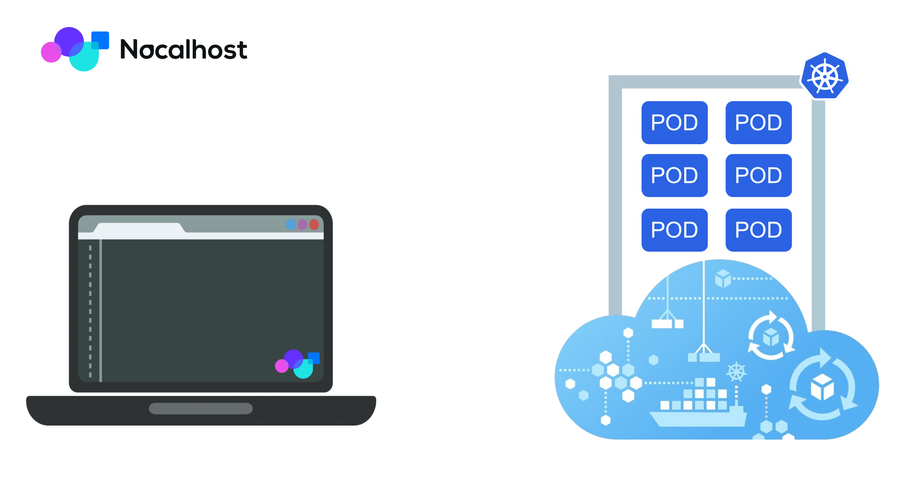
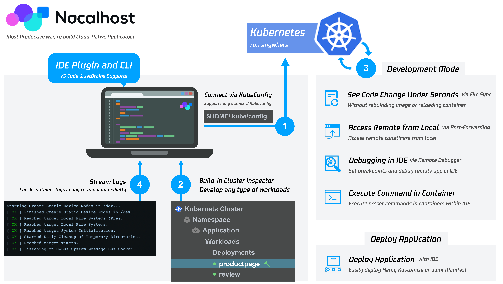
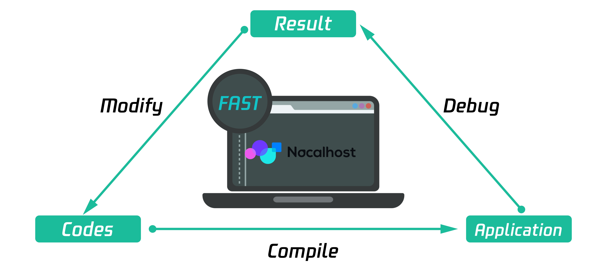

# 什么是 Nocalhost?

Nocalhost 是一个开源 IDE 插件，用于云原生应用程序开发:

- **直接在 Kubernetes 内部构建、测试和调试应用程序**
- **IDE 支持:** 即使在远程 Kubernetes 群集中，也可以在 IDE 中使用相同的调试和发展经验
- **使用即时文件同步开发:** 立即将代码更改为远程容器，而无需重建镜像或重新启动容器。

## 它是如何工作的？

Nocalhost 由单个二元 CLI 和 IDE 扩展组成。理想情况下，您将其直接与您喜欢的 IDE 一起使用。
Nocalhost 不需要服务器端组件，因为它像 Kubectl 一样，直接使用 Kubeconfig 通信到 Kubernetes 群集。

## 为什么要 Nocalhost？

构建 Kubernetes 应用程序通常很困难，对于大型开发人员来说，这甚至更难。Nocalhost 提供了构建云本地应用程序的最有效的方法。

使用 Nocalhost 直接在 Kubernetes 内部开发的优点是：

- **生产环境相似性** - Dev environment is very similar to your production environment, giving you much more confidence that everything will work in the production environment when new features are released.
- **加快反馈循环** - Via file synchronization, your code changes can take effect immediately in the container without rebuilding the image or redeploying the container.
- **灵活的可伸缩性** - Developers do not need to worry about insufficient local resources.
- **降低成本** - Use resources more efficiently and reduce IT facility costs

在 Kubernetes 群集中开发可能在以下情况下很有用:

- 当地资源的局限
- 想在类似生产的环境中测试您的应用程序
- 想调试很难在本地机器上复制的问题
- 应用程序需要访问集群内部服务（例如群集 DNS）

## 主要特征

### 在 Kubernetes 中进行编码

Nocalhost is preconfigured to work with your favourite IDEs, you can connect to any Kubernetes cluster with one click, and enjoying the coding in-cluster, get rid of the pesky local environment configurations.

### 即时文件同步

Nocalhost can automatically synchronize the code to the container every time you make a change. This way, eliminate the submit, building and pushing cycles, greatly speed up the feedback loop of development. So you see updates in under a second.

### 为协作而建

Nocalhost helps your team to standardize development workflows without requiring everyone on your team to become a Kubernetes expert.

- **Kubernetes and DevOps expert** on your team can configure and manager Cluster, Applications, DevSpace and Users by Nocalhost Server, Read more about [Nocalhost Server](./server/server-overview)
- **Developers** on your team can easily check out the project and start coding and debugging in the Kubernetes cluster without becoming a Kubernetes expert.

### 兼容性

Nocalhost 进行了许多 Kubernetes 发行的战斗测试:

- **当地的 Kubernetes 集群** like minikube, Microk8s, K3s and Docker Desktop
- **托管 Kubernetes 群集** like TKE (Tencent), ACK (Alibaba Cloud), GKE (Google), Microsoft Azure
- **自我管理的 Kubernetes 群集** (e.g. created with KubeSphere or Rancher)
