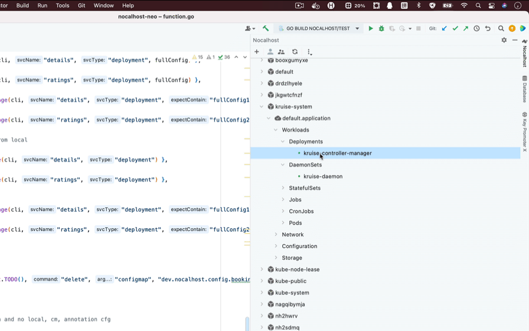

除了将配置放入 IDE 插件的`DevConfig`（右键单击）之外，Nocalhost 还支持将其放入源代码目录，ConfigMap 或注释中。
例如，您可以将配置置于注释，掌舵图或 RawManifest 中，以避免通过 IDE 重复配置。

!!! info "PRE-REQUIRE"

    请确保您已经知道如何正确配置Nocahost。 如果没有，请先阅读[Nocalhost概述](config-overview-en.md)。

## 零配置

Zero-configuration means to enter `DevMode` without any Nocalhost configuration. The only thing needed is to select or type in a development image.



### 零配置的行为期望

!!! info "Why care about the expectation of behavior?"

    In zero-configuration, you normally do not need to care about what Nocalhost has done. However, if any of the following behaviors does not meet your expectation, you need to configure Nocalhost to customize it.

- Use `/home/nocalhost-dev` in the container as the target directory for file synchronization.
- Try to enter the development container by using the following commands in order: zsh, bash, sh.
- Without persistence enabled, the local data generated in the development container will be lost after closing or restarting the container.
- Unable to use one-click running and debugging
- Synchronize all contents of the selected directory into the container

## 源代码目录中的配置

Nocalhost supports putting the configuration in source code directory, which can be done by experienced developers, so that other team members can share the configuration.

### 将配置添加到源代码

Check that the configuration works well in the `DevConfig` of a specific workload (right-click). Then copy it as below:

```yaml
name: nocalhost-api
serviceType: deployment
containers:
  - name: nocalhost-api
    dev:
      image: nocalhost-docker.pkg.coding.net/nocalhost/dev-images/golang:zsh
      env:
        - name: NOCALHOST_INJECT_DEV_ENV
          value: WHATEVER
```

Create `.nocalhost` directory in the corresponding source code directory, and then create a file named `config.yaml`. Paste and save the content in `config.yaml`.

### 生效

Right-click this workload again and click `DevConfig`. You will find that the configuration has been read from the local directory and there is a "Tips" at the top, indicating that this configuration is a in-memory replica of local file.

```yaml
# Tips: This configuration is a in-memory replica of local file:
#
# '/Users/anur/GolandProjects/nocalhost/.nocalhost/config.yaml'
#
# You should modify your configuration in local file, and the modification will
# take effect immediately. (Dev modification will take effect the next time you enter the DevMode)
#
# In addition, if you want to config multi service in same config.yaml, or use
# the Server-version of Nocalhost, you can also configure under the definition
# of the application, such as:
# https://github.com/nocalhost/bookinfo/blob/main/.nocalhost/config.yaml
#
```

### 问答

!!! question "当您忘记哪个本地目录与工作负载相关联"

    Right-click this workload and click `Open Project` to open the associated directory or click `Associate Local DIR` to associate a new directory.

!!! question "Multiple workloads in one source code"

    You can configure multiple workloads in one source code. To do this, add a layer to make the configuration items an array, as shown below:

    ```yaml
    - name: nocalhost-api
      serviceType: deployment
      containers:
        - name: nocalhost-api
          dev:
            image: nocalhost-docker.pkg.coding.net/nocalhost/dev-images/golang:zsh
            env:
              - name: NOCALHOST_INJECT_DEV_ENV
                value: WHATEVER

    - name: nocalhost-web
      serviceType: deployment
      containers:
        - name: nocalhost-web
          dev:
            image: nocalhost-docker.pkg.coding.net/nocalhost/dev-images/golang:zsh
    ```

## ConfigMap 中的配置

Nocalhost supports putting the configuration in Configmap, which helps to customize the association with the environment. For example, you can write some customized configurations in Configmap and apply it througth the deployment script or CD.

### 将配置添加到 ConfigMap 中

Here we display a very general Helm template of Nocalhost configuration. Note that you do not have to use Helm, and this is just an example for better explanation here.

```yaml
apiVersion: v1
kind: ConfigMap
metadata:
  name: "dev.nocalhost.config.{{ .Release.Name }}"
  labels:
    dep-management: nocalhost
  annotations:
    "helm.sh/hook": pre-install
data:
  config: |-
    {{ .Files.Get .Values.nocalhost.config.path | nindent 4 }}
```

!!! tip "What is `{{ .Release.Name }}`"

    You can find that there are two parts in configmap that are introduced as placeholders. The first is `{{ .Release.Name }}` in the fourth line, which is the name of application. If you are using Helm or Nocalhost to install the application, you need to write the corresponding application name in it, otherwise it should be `default.application` all the time.

!!! tip "What is `{{ .Files.Get .Values.nocalhost.config.path | nindent 4 }}`"

    This is indeed the position where Nocalhost config should be written in, with four indents.

After knowing the above placeholders, we give the real configmap, as shown in the following format:

```yaml
apiVersion: v1
kind: ConfigMap
metadata:
  name: "dev.nocalhost.config.default.application"
  labels:
    dep-management: nocalhost
  annotations:
    "helm.sh/hook": pre-install
data:
  config: |-
    - name: nocalhost-api
      serviceType: deployment
      containers:
        - name: nocalhost-api
          dev:
            image: nocalhost-docker.pkg.coding.net/nocalhost/dev-images/golang:zsh
            env:
              - name: NOCALHOST_INJECT_DEV_ENV
                value: WHATEVER

    - name: nocalhost-web
      serviceType: deployment
      containers:
        - name: nocalhost-web
          dev:
            image: nocalhost-docker.pkg.coding.net/nocalhost/dev-images/golang:zsh
```

### Configmap 配置注意配置

!!! danger "Notes"

    1. Naming rules: It must follow the format `dev.nocalhost.config.${appName}`, namely `name: "dev.nocalhost.config.{{ .Release.Name }}"`.
    2. Labels: It needs a key-value label, which is fixed as `dep-management: nocalhost`.
    3. config is in `data.config` as a text block and please pay attention to the indent of the configuration.

### 生效

After configuring Configmap, right-click this workload again and click `DevConfig`. If you get the following tips as below, indicating that this configuration is a in-memory replica of local file, that means the configuration has taken effect.

```yaml
# Tips: This configuration is a in-memory replica of configmap:
#
# 'dev.nocalhost.config.default.application'
#
# You should modify your configuration in configmap, and the modification will
# take effect immediately. (Dev modification will take effect the next time you enter the DevMode)
#
```

## 注释中的配置

Nocalhost also supports putting the configuration in annotations, which is for the same consideration as configmap.

### 在注释中添加配置

In like manner, we use a Helm template for explanation, which will help to understand which values should be customized and the corresponding format requirements.

```yaml
apiVersion: apps/v1
kind: Deployment
metadata:
  name: nocalhost-api
  annotations:
    dev.nocalhost: |-
      {{ .Files.Get .Values.nocalhost.annotations.path.authors | nindent 6 }}
```

Annotations configuration is very simple. Here you only need to declare an annotation, fix the key to `dev.nocalhost` and fix the value as a text block with six fixed indents. As shown below:

```yaml
apiVersion: apps/v1
kind: Deployment
metadata:
  name: nocalhost-api
  annotations:
    dev.nocalhost: |-
      name: nocalhost-api
      serviceType: deployment
      containers:
        - name: nocalhost-api
          dev:
            image: nocalhost-docker.pkg.coding.net/nocalhost/dev-images/golang:zsh
            env:
              - name: NOCALHOST_INJECT_DEV_ENV
                value: WHATEVER
```

Since one workload will not have multiple configurations, there is no need to declare it as array (although array is also supported).

Moreover, the configuration has been fixedly bound to the workload (whether it is Deployment, StatefulSet, DaemonSet or others), so there is also no need to declare its name and type. As shown below:

```yaml
apiVersion: apps/v1
kind: Deployment
  metadata:
  name: nocalhost-api
  annotations:
    dev.nocalhost: |-
      containers:
        - name: nocalhost-api
          dev:
           image: nocalhost-docker.pkg.coding.net/nocalhost/dev-images/golang:zsh
           env:
             - name: NOCALHOST_INJECT_DEV_ENV
               value: WHATEVER
```

### 注释配置注意

!!! danger "Notes"

    1. The key must be `dev.nocalhost`, and the value must be a text block of `Nocalhost Config`.
    2. Pay attention to the indent.

### 生效

After configuring the Annotation, right-click this workload again and click `DevConfig`. The following tips means the configuration has taken effect.

```yaml
# Tips: This configuration is a in-memory replica of annotation:
#
# annotations:
#   dev.nocalhost: |
#     [Your Config]
#
# You should modify your configuration in resource's annotation', and the modification will
# take effect immediately. (Dev modification will take effect the next time you enter the DevMode)
#
```

## 本地，配置和注释配置的功能

### 配置的粒度和优先级

Nocalhost supports hybrid configurations, for example, if there are ten workloads, three of them can be local, three are Configmap, three are Annotations, and the last one is zero-configuration.

!!! info "If a workload is configured with multiple ways, the priority is as follows:"

    Local > Annotations > Configmap > in DevConfig

### 配置读取时间

Before using Nocalhost configuration, Nocalhost will check all configuration methods and try to read them. Therefore, the read of the configuration can be considered to be real-time.

### DevConfig 特征

Please read [Nocalhost DevConfig Features](config-overview-en.md#四、开发配置的特性)
