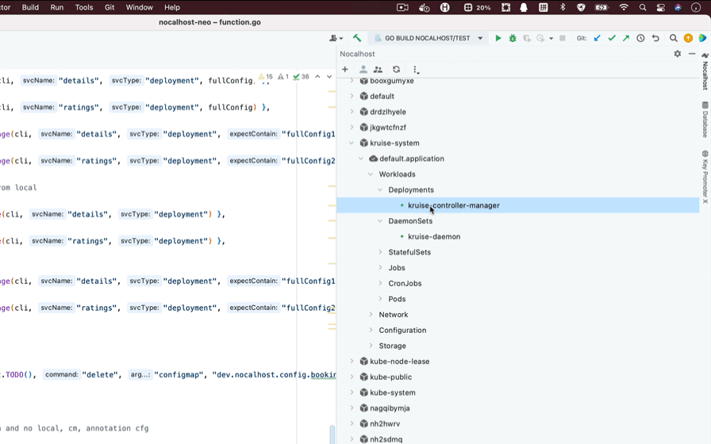

除了将配置放入 IDE 插件的`DevConfig`（右键单击）之外，Nocalhost 还支持将其放入源代码目录， `ConfigMap` 或注释中。
例如，您可以将配置置于注释，Helm 图或 RawManifest 中，以避免通过 IDE 重复配置。

!!! info "预先提取"

    请确保您已经知道如何正确配置Nocahost。 如果没有，请先阅读[Nocalhost概述](config-overview.md)。

## 零配置

零配置是指在没有任何 Nocalhost 配置的情况下进入`DevMode`。
惟一需要做的是选择或键入一个开发映像。



### 零配置的行为期望

!!! info "为什么要关心行为的期望？"

    在零配置中，通常不需要关心Nocalhost做了什么。
    但如果以下行为不符合您的期望，则需要配置Nocalhost进行自定义。

- 使用容器中的`/home/nocalhost-dev`作为文件同步的目标目录。
- 尝试按顺序使用以下命令进入开发容器:zsh、bash、sh。
- 如果不启用持久性，在开发容器中生成的本地数据将在关闭或重新启动容器后丢失。
- 无法使用一键式运行和调试
- 将所选目录的所有内容同步到容器中

## 源代码目录中的配置

Nocalhost 支持将配置放入源代码目录中，可以由经验丰富的开发人员完成，以便其他团队成员可以共享配置。

### 将配置添加到源代码

检查配置是否在特定工作负载的`DevConfig`中正常工作(右键单击)。然后复制如下:

```yaml
name: nocalhost-api
serviceType: deployment
containers:
  - name: nocalhost-api
    dev:
      image: nocalhost-docker.pkg.coding.net/nocalhost/dev-images/golang:zsh
      env:
        - name: NOCALHOST_INJECT_DEV_ENV
          value: WHATEVER
```

在相应的源代码目录中创建`.nocalhost`目录，然后创建一个名为`config.yaml`的文件。
粘贴并保存在`config.yaml`中。

### 生效

再次右键单击此工作负载并单击`DevConfig`。
您将发现配置是从本地目录中读取的，顶部有一个`Tips`，表明该配置是本地文件的内存副本。

```yaml
# Tips: This configuration is a in-memory replica of local file:
#
# '/Users/anur/GolandProjects/nocalhost/.nocalhost/config.yaml'
#
# You should modify your configuration in local file, and the modification will
# take effect immediately. (Dev modification will take effect the next time you enter the DevMode)
#
# In addition, if you want to config multi service in same config.yaml, or use
# the Server-version of Nocalhost, you can also configure under the definition
# of the application, such as:
# https://github.com/nocalhost/bookinfo/blob/main/.nocalhost/config.yaml
#
```

### 问答

!!! question "当您忘记哪个本地目录与工作负载相关联"

    右键单击该工作负载并单击“Open Project”以打开相关目录或单击“Associate Local DIR”以关联一个新目录。

!!! question "一个源代码中的多个工作负载"

    您可以在一个源代码中配置多个工作负载。为此，添加一个层，使配置项成为一个数组，如下所示:

    ```yaml
    - name: nocalhost-api
      serviceType: deployment
      containers:
        - name: nocalhost-api
          dev:
            image: nocalhost-docker.pkg.coding.net/nocalhost/dev-images/golang:zsh
            env:
              - name: NOCALHOST_INJECT_DEV_ENV
                value: WHATEVER

    - name: nocalhost-web
      serviceType: deployment
      containers:
        - name: nocalhost-web
          dev:
            image: nocalhost-docker.pkg.coding.net/nocalhost/dev-images/golang:zsh
    ```

## ConfigMap 中的配置

Nocalhost 支持将配置放在 Configmap 中，这有助于自定义与环境的关联。
例如，您可以在 Configmap 中编写一些定制配置，并通过部署脚本或 CD 应用它。

### 将配置添加到 ConfigMap 中

这里我们展示了一个非常通用的 Nocalhost 配置 Helm 模板。
请注意，你不一定要使用 Helm，这只是一个例子，以便更好地解释。

```yaml
apiVersion: v1
kind: ConfigMap
metadata:
  name: "dev.nocalhost.config.{{ .Release.Name }}"
  labels:
    dep-management: nocalhost
  annotations:
    "helm.sh/hook": pre-install
data:
  config: |-
    {{ .Files.Get .Values.nocalhost.config.path | nindent 4 }}
```

!!! tip "什么是 `{{ .Release.Name }}`"

    您可以发现configmap中有两个部分是作为占位符引入的。
    第一个是第四行中的`{{ .Release.Name }}`，这是应用程序的名称。
    如果您使用Helm或Nocalhost安装应用程序，您需要在其中写入相应的应用程序名称，否则它应该一直是`default.application`。

!!! tip "什么是 `{{ .Files.Get .Values.nocalhost.config.path | nindent 4 }}`"

    这确实是应该写入Nocalhost配置的位置，有四个缩进。

在知道了上面的占位符之后，我们给出了真正的 configmap，如下所示:

```yaml
apiVersion: v1
kind: ConfigMap
metadata:
  name: "dev.nocalhost.config.default.application"
  labels:
    dep-management: nocalhost
  annotations:
    "helm.sh/hook": pre-install
data:
  config: |-
    - name: nocalhost-api
      serviceType: deployment
      containers:
        - name: nocalhost-api
          dev:
            image: nocalhost-docker.pkg.coding.net/nocalhost/dev-images/golang:zsh
            env:
              - name: NOCALHOST_INJECT_DEV_ENV
                value: WHATEVER

    - name: nocalhost-web
      serviceType: deployment
      containers:
        - name: nocalhost-web
          dev:
            image: nocalhost-docker.pkg.coding.net/nocalhost/dev-images/golang:zsh
```

### Configmap 配置注意配置

!!! danger "Notes"

    1. Naming rules: It must follow the format `dev.nocalhost.config.${appName}`, namely `name: "dev.nocalhost.config.{{ .Release.Name }}"`.
    2. Labels: It needs a key-value label, which is fixed as `dep-management: nocalhost`.
    3. config is in `data.config` as a text block and please pay attention to the indent of the configuration.

### 生效

After configuring Configmap, right-click this workload again and click `DevConfig`. If you get the following tips as below, indicating that this configuration is a in-memory replica of local file, that means the configuration has taken effect.

```yaml
# Tips: This configuration is a in-memory replica of configmap:
#
# 'dev.nocalhost.config.default.application'
#
# You should modify your configuration in configmap, and the modification will
# take effect immediately. (Dev modification will take effect the next time you enter the DevMode)
#
```

## 注释中的配置

Nocalhost also supports putting the configuration in annotations, which is for the same consideration as configmap.

### 在注释中添加配置

In like manner, we use a Helm template for explanation, which will help to understand which values should be customized and the corresponding format requirements.

```yaml
apiVersion: apps/v1
kind: Deployment
metadata:
  name: nocalhost-api
  annotations:
    dev.nocalhost: |-
      {{ .Files.Get .Values.nocalhost.annotations.path.authors | nindent 6 }}
```

Annotations configuration is very simple. Here you only need to declare an annotation, fix the key to `dev.nocalhost` and fix the value as a text block with six fixed indents. As shown below:

```yaml
apiVersion: apps/v1
kind: Deployment
metadata:
  name: nocalhost-api
  annotations:
    dev.nocalhost: |-
      name: nocalhost-api
      serviceType: deployment
      containers:
        - name: nocalhost-api
          dev:
            image: nocalhost-docker.pkg.coding.net/nocalhost/dev-images/golang:zsh
            env:
              - name: NOCALHOST_INJECT_DEV_ENV
                value: WHATEVER
```

Since one workload will not have multiple configurations, there is no need to declare it as array (although array is also supported).

Moreover, the configuration has been fixedly bound to the workload (whether it is Deployment, StatefulSet, DaemonSet or others), so there is also no need to declare its name and type. As shown below:

```yaml
apiVersion: apps/v1
kind: Deployment
  metadata:
  name: nocalhost-api
  annotations:
    dev.nocalhost: |-
      containers:
        - name: nocalhost-api
          dev:
           image: nocalhost-docker.pkg.coding.net/nocalhost/dev-images/golang:zsh
           env:
             - name: NOCALHOST_INJECT_DEV_ENV
               value: WHATEVER
```

### 注释配置注意

!!! danger "Notes"

    1. The key must be `dev.nocalhost`, and the value must be a text block of `Nocalhost Config`.
    2. Pay attention to the indent.

### 生效

After configuring the Annotation, right-click this workload again and click `DevConfig`. The following tips means the configuration has taken effect.

```yaml
# Tips: This configuration is a in-memory replica of annotation:
#
# annotations:
#   dev.nocalhost: |
#     [Your Config]
#
# You should modify your configuration in resource's annotation', and the modification will
# take effect immediately. (Dev modification will take effect the next time you enter the DevMode)
#
```

## 本地，配置和注释配置的功能

### 配置的粒度和优先级

Nocalhost supports hybrid configurations, for example, if there are ten workloads, three of them can be local, three are Configmap, three are Annotations, and the last one is zero-configuration.

!!! info "If a workload is configured with multiple ways, the priority is as follows:"

    Local > Annotations > Configmap > in DevConfig

### 配置读取时间

Before using Nocalhost configuration, Nocalhost will check all configuration methods and try to read them. Therefore, the read of the configuration can be considered to be real-time.

### DevConfig 特征

Please read [Nocalhost DevConfig Features](config-overview.md#四、开发配置的特性)
