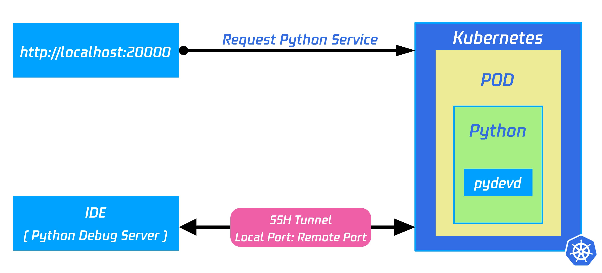
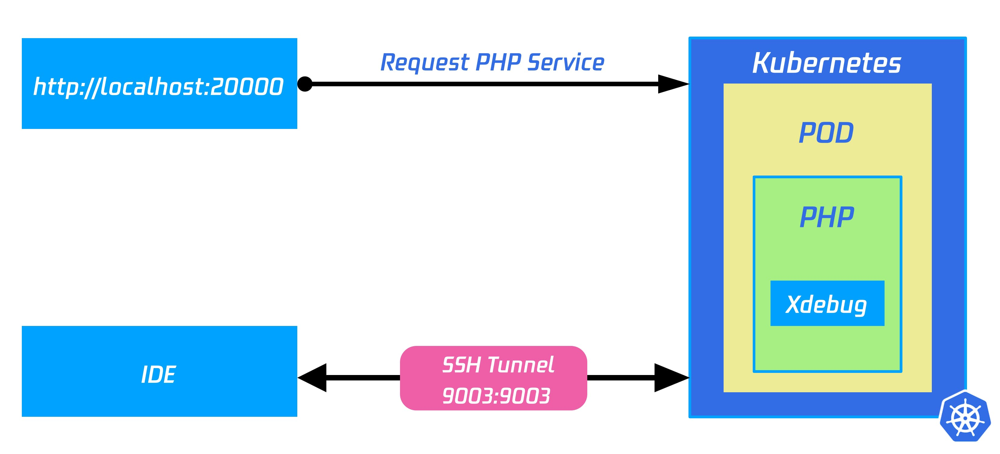

## 配置

开发人员之间的开发环境是不同的。请根据实际情况配置远程调试配置。

### 示例配置

=== "java"

    ```yaml title="Nocalhost Configs" hl_lines="8 11"
    name: java-remote-debugging
    serviceType: deployment
    containers:
      - name: ""
        dev:
            ...
            command:
              debug:
                - ./debug.sh
            debug:
              remoteDebugPort: 5005
            ...
    ```

    #### Maven 示例

    The shell command for **Maven** !!! example

    ```bash title="jdk >= 1.8 and springBoot >=2.2.1.RELEASE"
    mvn spring-boot:run -Dspring-boot.run.jvmArguments="-Xdebug -Xrunjdwp:transport=dt_socket,server=y,suspend=y,address=5005"
    ```

    For jdk <=1.7 you should replace `-agentlib:jdwp=transport=dt_socket,server=y,suspend=n,address=*:5005` with `-Xdebug -Xrunjdwp:transport=dt_socket,server=y,suspend=y,address=5005`

    For lower version of the springBoot you should replace `-Drun.jvmArguments` with `-Dspring-boot.run.jvmArguments`

    #### Gradle 例子

    The startup command for **Gradle** !!! example

    ```bash title="Gradle's debug.sh"
    ./gradlew bootRun --debug-jvm --no-daemon
    ```

=== "python"

    ```yaml title="Nocalhost Configs" hl_lines="8 11"
    name: python-remote-debugging
    serviceType: deployment
    containers:
      - name: ""
        dev:
            ...
            command:
              debug:
                - ./debug.sh
            debug:
              remoteDebugPort: 9009
            ...
    ```

    === "jetbrains"

        ```yaml title="debug.sh"
        #! /bin/sh

        pip3 install --no-cache-dir -r ./requirements.txt

        export DEBUG_DEV=0
        export FLASK_DEBUG=0
        export FLASK_ENV=development

        flask run --host=0.0.0.0 --port=9999
        ```

    === "vscode"

        ```yaml title="debug.sh"
        #! /bin/sh

        pip3 install --no-cache-dir -r ./requirements.txt

        python -m debugpy --listen 9009 --wait-for-client productpage.py 9080
        ```


        **How does it Works?**

        Nocalhost using pydevd to debug Python application.

        

=== "go"

    ```yaml title="Nocalhost Configs"  hl_lines="8 11"
    name: go-remote-debugging
    serviceType: deployment
    containers:
      - name: ""
        dev:
            ...
            command:
              debug:
                - ./debug.sh
            debug:
              remoteDebugPort: 9009
            ...
    ```

    ```yaml title="debug.sh"
    #! /bin/sh

    export GOPROXY=https://goproxy.cn
    dlv --headless --log --listen :9009 --api-version 2 --accept-multiclient debug app.go
    ```

=== "php"

    ```yaml title="Nocalhost Configs"  hl_lines="8 11"
    name: php-remote-debugging
    serviceType: deployment
    containers:
      - name: ""
        dev:
            ...
            command:
              debug:
                - ./debug.sh
            debug:
              remoteDebugPort: 9003
            ...
    ```

    ```yaml title="debug.sh"
    #！/bin/sh

    php -t ./ -S 0.0.0.0:9999;
    ```

    **How does it works?**

    Nocalhost using Xdebug to debug PHP applications.

    

=== "node"

    ```yaml title="Nocalhost Configs"  hl_lines="8 11"
    name: nodejs-remote-debugging
    serviceType: deployment
    containers:
      - name: ""
        dev:
            ...
            command:
              debug:
                - ./debug.sh
            debug:
              remoteDebugPort: 9229
            ...
    ```

    ```yaml title="debug.sh"
    #！/bin/sh

    npm install
    node --inspect=0.0.0.0:9229 ./index.js
    ```

=== "ruby"

    ```yaml title="Nocalhost Configs"  hl_lines="8 11"
    name: nodejs-remote-debugging
    serviceType: deployment
    containers:
      - name: ""
        dev:
            ...
            command:
              debug:
                - ./debug.sh
            debug:
              remoteDebugPort: 9001
            ...
    ```

    ```yaml title="debug.sh"
    #！/bin/sh

    rdebug-ide -h 0.0.0.0 -p 9001 -- details.rb 9080
    ```
