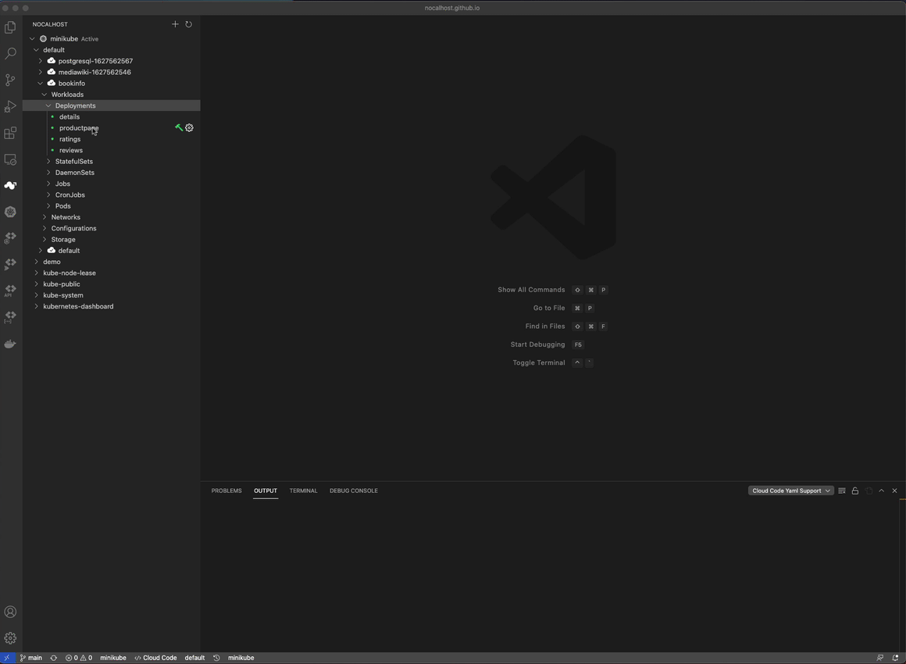
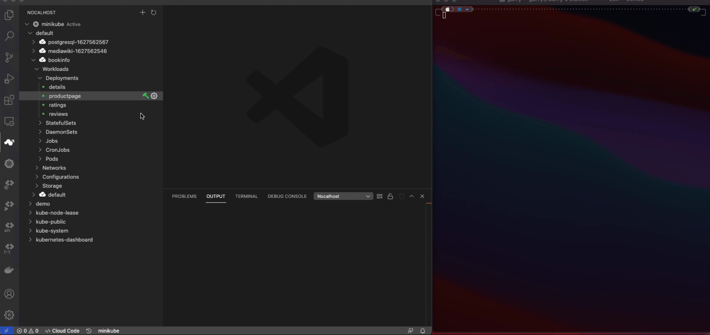
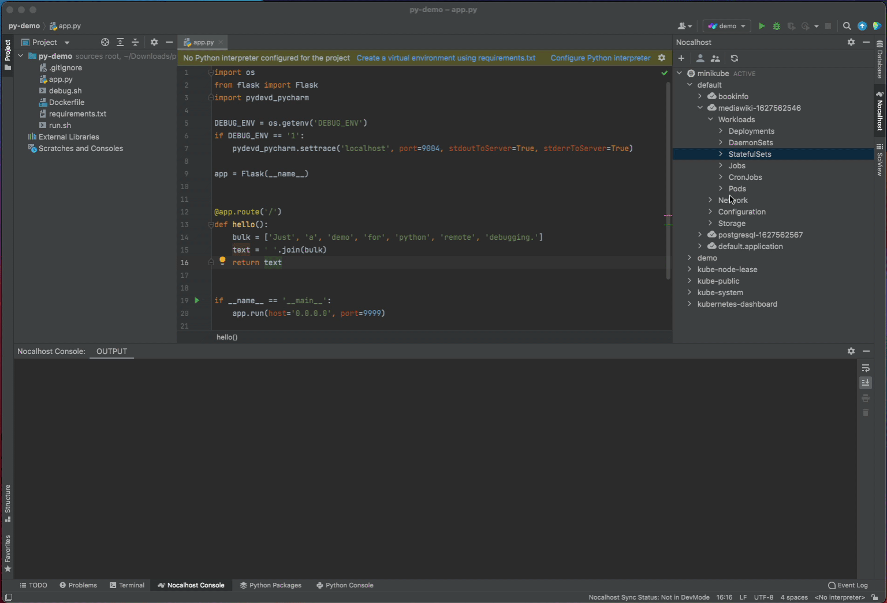
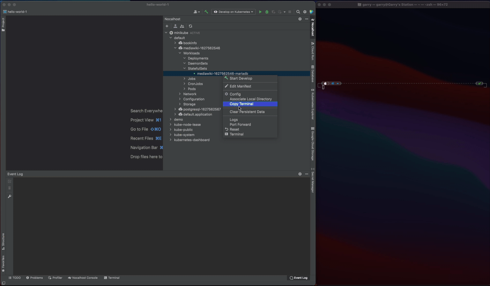

# 访问容器的终端

Nocalhost 提供了两种模式来访问目标容器的端子。

- **打开远程终端:** 访问 IDE 构建终端内的容器终端。
- **复制终端执行命令:** Nocalhost 将复制远程终端的执行命令，您可以将此命令粘贴到任何终端工具中，然后运行它，然后访问容器的终端。

## VS Code

=== "open"

    

=== "copy"

    

## JetBrains

=== "jb-open"

    

=== "jb-copy"

    
