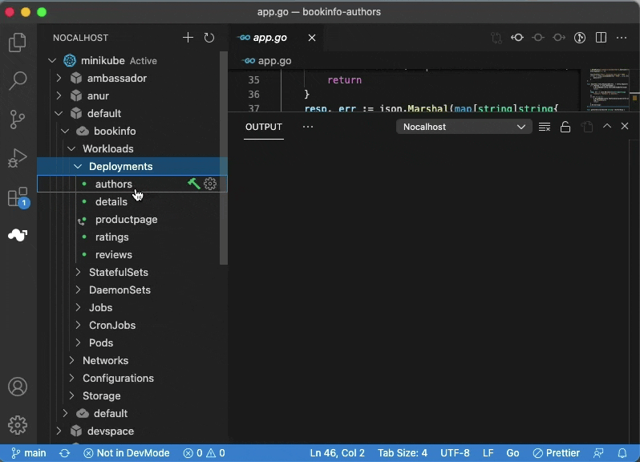

## 支持的语言

| Language | Required Plugin                                                                                    | Dev Image Required |
| -------- | -------------------------------------------------------------------------------------------------- | ------------------ |
| Java     | [Debugger for Java](https://marketplace.visualstudio.com/items?itemName=vscjava.vscode-java-debug) | N/A                |
| Go       | [Go](https://marketplace.visualstudio.com/items?itemName=golang.Go)                                | dlv                |
| Python   | [Python](https://marketplace.visualstudio.com/items?itemName=ms-python.python)                     | debugpy            |
| PHP      | [PHP Debug](https://marketplace.visualstudio.com/items?itemName=felixfbecker.php-debug)            | xdebug             |
| Node.js  | N/A                                                                                                | N/A                |
| Ruby     | [Ruby](https://marketplace.visualstudio.com/items?itemName=rebornix.Ruby)                          | ruby-debug-ide     |

### 插件配置

=== "java"

    Java开发套件的路径可以通过VS代码设置中的`java.home`设置指定 (workspace/user settings). 如果未指定，则按以下顺序搜索，直到JDK满足当前的最低要求，有关扩展JDK配置，请参见[设置JDK](https://github.com/redhat-developer/vscode-java#setting-the-jdk).

    - `JDK_HOME` 环境变量
    - `JAVA_HOME` 环境变量
    - 在当前系统路径上

=== "go"

    The extension uses a few command-line tools developed by the Go community。in particular, `go`, `gopls`, and `dlv` must be installed for this extension to work correctly. See the [tools documentation](https://github.com/golang/vscode-go/blob/master/docs/tools.md) for a complete list of tools the extension depends on.

    In order to locate these command-line tools, the extension searches `GOPATH/bin` and directories specified in the `PATH` environment variable (or Path on Windows) with which the VS Code process has started. If the tools are not found, the extension will prompt you to install the missing tools and show the **"⚠️ Analysis Tools Missing"** warning in the bottom right corner. Please install them by responding to the warning notification, or by manually running the `Go: Install/Update Tools command`.

## 调试过程

1. Select the workload that you want to debug
2. Right-click the workload and select **`Dev Config`**, [configure your debugging configuration](#Configuration)
3. Then right-click this workload again and select `Remote Debug`
4. Nocalhost will automatically install the dependencies on the first debug
5. Nocalhost will automatically enter the `DevMode` and start remote debugging



## IDE 中调试配置

### VSCODE 调试配置

nocalhost will automatically configure `launch.json` of `vscode` when debug is finished, next time you can launch debug directly with shortcut key **`F5`**

### 调试参数

debug supports custom parameters to start, you just need to add parameters under `configurations` in `launch.json`, and the plugin will pass the parameters to the debugger when debug is launched.

If you need to enable diagnostic output when debugging a `Node.js` application, you just need to change the following configuration.

```json title="launch.json"
{
  "version": "0.2.0",
  "configurations": [
    {
      "type": "nocalhost",
      "request": "attach",
      "name": "Nocalhost Debug",
      "trace": true
    }
  ]
}
```

### 支持的调试参数

- Java: [Debugger for Java](https://code.visualstudio.com/docs/java/java-debugging#_attach)
- Go: [Go](https://github.com/golang/vscode-go/blob/master/docs/debugging.md#attach)
- Python: [Python](https://code.visualstudio.com/docs/python/debugging#_set-configuration-options)
- PHP: [PHP Debug](https://github.com/xdebug/vscode-php-debug#supported-launchjson-settings)
- Node.js: [VSCode](https://code.visualstudio.com/docs/nodejs/nodejs-debugging#_remote-debugging)
- Ruby: [Ruby](https://github.com/rubyide/vscode-ruby/wiki/3.-Attaching-to-a-debugger)

### 常问问题

??? question "Java 调试器停在`java.lang.reflect.Method.class`文件中的`return ma.invoke(obj, args);`中。"

    Execute the `Java: Clean the Java language server workspace` command
