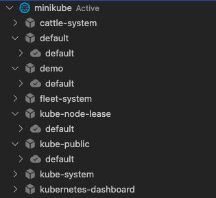
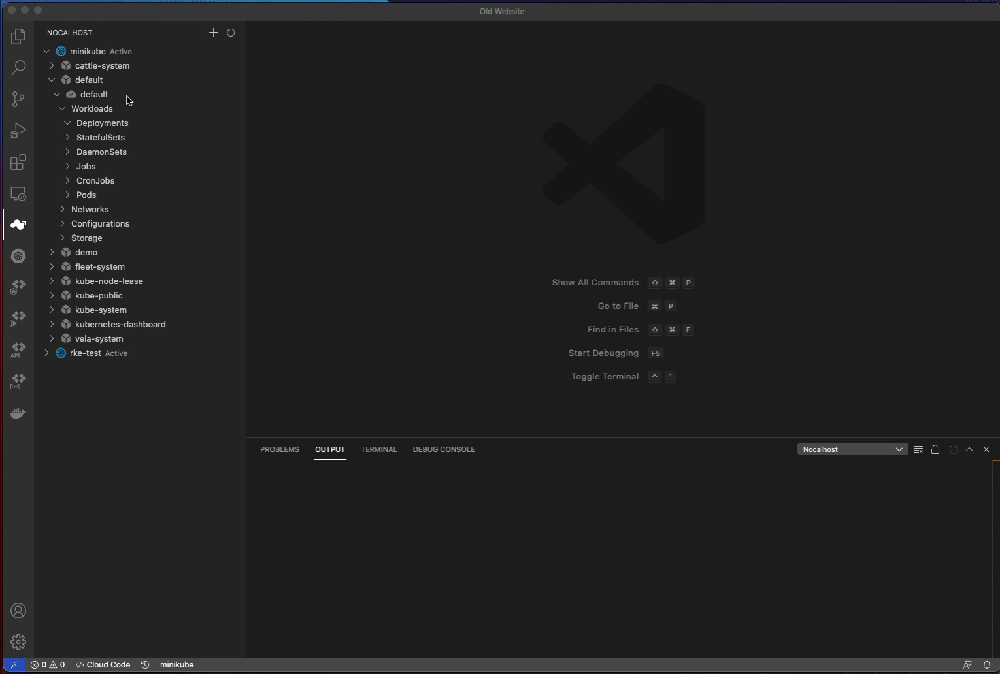
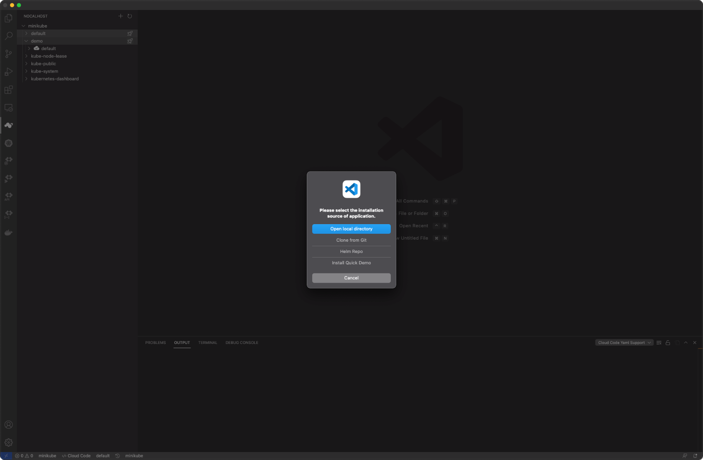
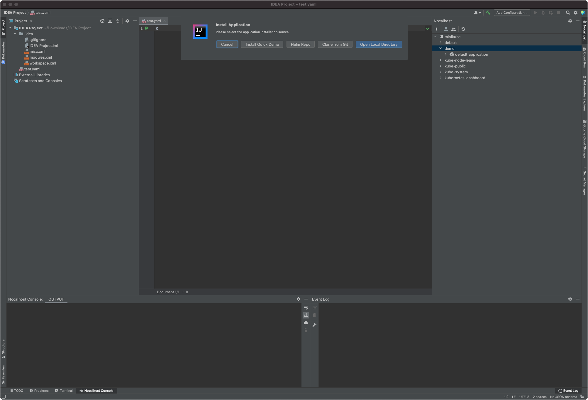

Nocalhost 提供了一种简便的方法来帮助您管理 IDE 内部的 Kubernetes 应用程序部署。

## 什么是`default`？

当你在 Nocalhost 插件中扩展任何 Kubernetes 命名空间时，你可能会看到一些名为 `default` 和{ width="20" }图标的东西。

在 Kubernetes 中，[工作负载](https://kubernetes.io/docs/concepts/workloads/)是一个应用程序，无论您的工作负载是单个组件还是多个协同工作的组件。

但是在现实世界中，我们的情况更为复杂。
微服务架构应用程序由许多工作负载组成。
考虑一下您是否有一百个这些应用程序。
名称空间中的工作负载列表将很长，很难读取和搜索。

Nocalhost 使用注释将相关工作负载组合到单个`application`中。
当您部署`已配置的 Nocalhost 应用程序`或[Helm](https://helm.sh/)应用程序时，Nocalhost 可以将其标识为`application`并对所有相关工作负载进行分组。
否则，Nocalhost 会将所有未识别的工作负载分组到“默认应用程序”中。

!!! tip "区别"

    `已配置的Nocalhost应用程序`仍然是Kubernetes清单中的单个或分组。
    它不会改变原来的Kubernetes清单架构。
    它只是添加了一些只有Nocalhost使用的配置。

与上述描述相对应，您可以使用 Nocalhost 部署不同的配置的 Kubernetes 应用程序。

## 部署 Kubernetes Manifest

您可以使用 Nocalhost 插件部署 Kubernetes 清单或 Kustomizations。这类似于`kubectl apply -f`。

!!! caution "在应用程序中部署"

    你只能在`application`中部署Kubernetes清单。
    如果命名空间中有任何`application`，则可以部署到`default`应用程序。

#### 过程

1. 右键单击任意命名空间并选择 **Apply Manifest**
2. 选择一个 Kubernetes 清单文件或包含一组清单文件的文件夹

## 部署配置的 Nocalhost 应用程序

!!! danger "需要配置"

    在部署应用程序之前，您需要配置 `config.yaml` 。[了解如何配置应用程序部署](../../config/deployment/quickstart.md).

=== "vscode"

    1. Select a namespace
    2. Click on the {width="20"} icon to deploy application
    3. Choose the installation source

    

=== "jet"

    1. Right click a namespace, click `Install Application`
    2. Choose the installation source

    

### 安装源

Nocalhost 支持从本地目录，GIT 存储库和 Helm 存储库安装应用程序。

**From Local Directory** and **From Git Repository**

Nocalhost will analyze the deployment configuration in the `.nocalhost` folder in your application directory or Git repository, looking for clues on how to deploy your application.

**From Helm Repository**

Nocalhost will run the `helm install` to deploy your helmChart. [Read more to learn about `helm install`](https://helm.sh/docs/helm/helm_install/)

!!! danger "Helm 需要"

    您需要在您的计算机中安装[Helm](https://helm.sh)，然后才能通过Helm进行安装
