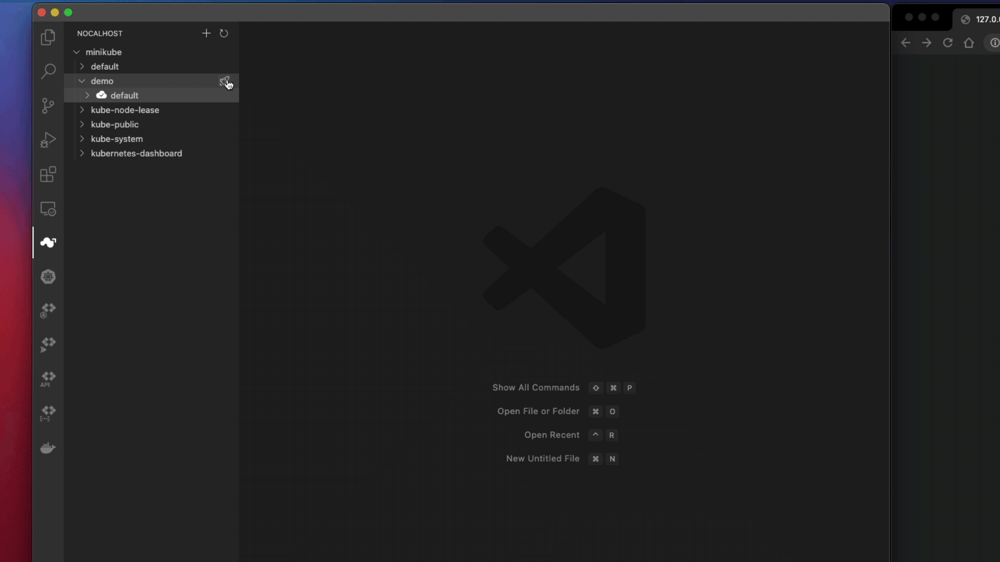

Nocalhost IDE 插件具有内置的演示应用程序，您可以通过以下步骤快速安装它：

1. 从群集树中选择任何名称空间
2. 单击图标以部署应用程序
3. 选择 `Install Quick Demo` 安装演示应用程序

!!! tip "Access Demo"

    Quick demo application comes with port-forward configured. After demo has successfully deployed (check the deployment status from the cluster tree), you can access the demo from your local web browser by visiting [http://127.0.0.1:39080](http://127.0.0.1:39080)
