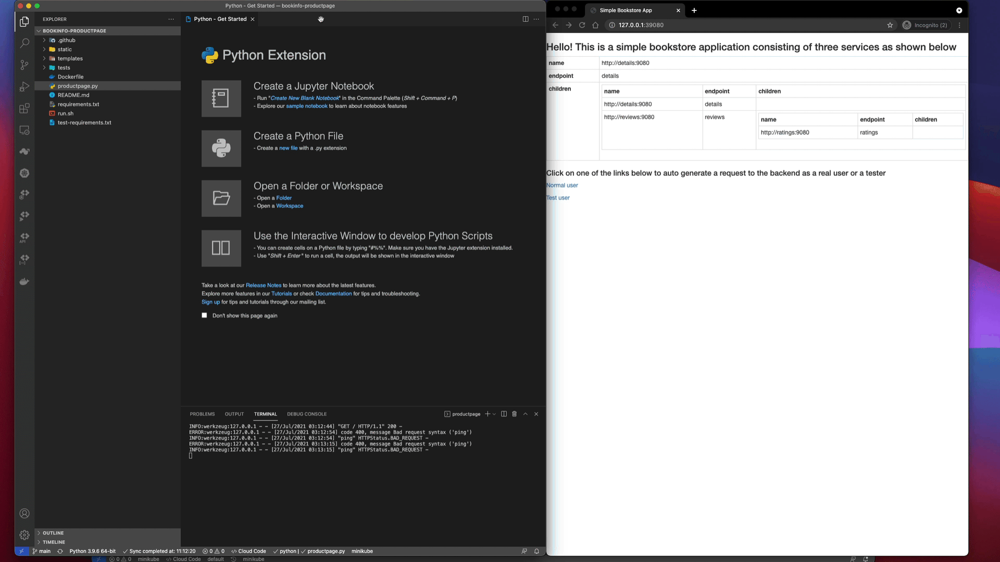

Nocalhost 允许您直接在 Kubernetes 集群内开发应用程序。

## 使用集群检查器

Nocalhost 建筑物集群检查器。您可以使用集群检查器在 Kubernetes 集群中浏览资源，部署应用程序并选择要开发和调试的工作负载。

### 资源状态

Nocalhost 使用以下图标来描述集群检查器中不同 Kubernetes 资源的状态。

<table>
    <thead>
        <tr>
            <th>Resource</th>
            <th>Status</th>
            <th>Icon</th>
            <th>Description</th>
        </tr>
    </thead>
    <tbody>
        <tr>
            <td rowSpan="2">Cluster</td>
            <td>Active</td>
            <td></td>
            <td>连接到集群</td>
        </tr>
        <tr>
            <td>Inactive</td>
            <td></td>
            <td>无法连接到集群</td>
        </tr>
        <tr>
            <td rowSpan="2">DevSpace</td>
            <td>Normal</td>
            <td></td>
            <td>普通的DevSpace/Namespace</td>
        </tr>
        <tr>
            <td>Read Only</td>
            <td></td>
            <td>可读的DevSpace/Namespace，无法操作</td>
        </tr>
        <tr>
            <td rowSpan="3">Application</td>
            <td>Active</td>
            <td></td>
            <td>应用程序能够操作</td>
        </tr>
        <tr>
            <td>Inactive</td>
            <td></td>
            <td>应用程序不活动，无法操作</td>
        </tr>
        <tr>
            <td>Loading</td>
            <td></td>
            <td>安装或卸载</td>
        </tr>
        <tr>
            <td rowSpan="5">Development Mode</td>
            <td>Start DevMode</td>
            <td></td>
            <td>工作负载在Devmode中</td>
        </tr>
        <tr>
            <td>End DevMode</td>
            <td></td>
            <td>结束DevMode</td>
        </tr>
        <tr>
            <td>Others</td>
            <td></td>
            <td>其他启用了DevMode</td>
        </tr>
        <tr>
            <td>DevMode and Port-Forwarding</td>
            <td></td>
            <td>在启用DevMode和port-forwarding中</td>
        </tr>
        <tr>
            <td>DevMode and Port-Forwarding, enabled by others</td>
            <td></td>
            <td>其他将工作负载启用到DevMode和port-forwarding</td>
        </tr>
        <tr>
            <td rowSpan="2">Nocalhost Configs</td>
            <td>Normal</td>
            <td></td>
            <td>此工作负载具有Nocalhost配置</td>
        </tr>
        <tr>
            <td>Warning</td>
            <td></td>
            <td>Nocalhost配置为空</td>
        </tr>
        <tr>
            <td rowSpan="4">Workload Status</td>
            <td>Not Ready</td>
            <td></td>
            <td>此工作负载还没有准备好，例如部署</td>
        </tr>
        <tr>
            <td>Running</td>
            <td></td>
            <td>这个工作负载正在运行</td>
        </tr>
        <tr>
            <td>Failed</td>
            <td></td>
            <td>此工作负载未能运行</td>
        </tr>
        <tr>
            <td>Unknown</td>
            <td></td>
            <td>此工作负载状态未知</td>
        </tr>
    </tbody>
</table>

## 进入 DevMode 之前

在 DevMode 之前，您需要处理一些配置。

### 源代码目录

在开发应用程序之前，您需要告诉 Nocalhost 源代码的位置，因此 Nocalhost 可以将源代码文件同步到远程容器。您可以通过 Nocalhost 从 GIT 存储库中指定本地目录或克隆源代码。

You can [Associate Local Directory](#associate-local-directory) before entering DevMode. Alternatively, Nocalhost will check the directory path. If you do not have an associated directory, Nocalhost will pop the selection menu to ask you to `specify the source directory. You can [Open Local Directory](#open-local-directory) or [Clone from Git Repo](#clone-from-git-repository).

#### 合并本地目录

您可以在输入 DevMode 之前将本地源代码目录与工作负载相关联。关联此目录后，Nocalhost 将在数据库中保存此目录路径。

当您输入 DevMode 时，Nocalhost 将使用此路径目录，而不是要求输入。

**Steps:**

1. Select the workload
2. Right-click and select the **`Associate Local DIR`**
3. Choose the local directory and confirm the selection

!!! tip "Cross IDE"

    If you have associated the directory in one IDE already, once you develop the same workload in the other IDE, Nocalhost will still use the directory path set before.

    For example, when a workload is associated with a directory in VS Code, then switch to IDEA. Nocalhost will firstly use the directory you associated in VS Code until you associate again.

#### 打开本地目录

您可以选择任何本地目录并确认选择。Nocalhost 将保存数据库中的目录路径。


#### GIT 存储库的克隆

!!! danger "Limitation"

    如果您已经关联或打开了目录，则Nocalhost不会从GIT中克隆源代码。

Nocalhost 可以帮助您从 IDE 内的 GIT 存储库中克隆源代码。

如果您选择 **`Clone from Git Repository`**, Nocalhost 将尝试根据[`dev.giturl`](../../config/config-enhance.md#源码地址)部分从 URL 中克隆源代码，或要求您输入 GIT URL。

!!! info "Auto-associate"

    Nocalhost将在克隆代码后自动将目录与克隆目录相关联。

### 开发容器

使用开发容器输入 DevMode 时，Nocalhost 将替换工作负载容器。
Nocalhost 将加载 Nocalhost 配置的`container[*].dev`部分。

#### 开发映像

Nocalhost 在输入 DevMode 之前需要知道要使用哪个`development image`。
Nocalhost 将使用[`dev.image`](../../config/config-dev-container.md#DevImage)中定义的映像或要求您输入一个映像。

您可以使用我们提供的 Docker 映像，也可以使用任何`development image`的[自定义映像](../../config/config-dev-container.md#DevImage).


!!! info "Image Pull"

    容器映像将由Kubernetes处理，[阅读更多以了解Kubernetes映像管理](https://kubernetes.io/docs/concepts/containers/images/).

## 开始开发模式

### 选择工作量

1. 扩展集群检查器
2. 选择要开发的工作负载并单击 **`Start DevMode`** 要么 **`Start DevMode(Duplicate)`**
3. 如果您在此工作负载中有多个容器，请选择一个容器

!!! caution "Container"

    如果工作负载中有多个容器，则只能选择一个容器以输入DevMode。


### DevMode 过程

进入 DevMode 时，Nocalhost 将做以下事情：

1. **替换 Pods** 根据你的[`replacing port` 配置](../../config/config-spec.md)
2. **转发端口** 根据你的[`port-forwarding` 配置](../../config/config-enhance.md#开发模式后自动端口转发)
3. **同步文件更改** 根据[`dev.sync`](../../config/config-enhance.md#文件同步)部分的本地项目目录和 Kubernetes Pod 在本节之间
4. **打开终端** 在容器启动后，就在 IDE 内。打开的工作目录是根据您的[`dev.workdir`](../../config/config-dev-container.md#)(The Remote Directory for File Synchronization)部分的。

终端会话开始后，您就可以启动应用程序并在容器内部工作。

```bash title="远程终端会话开始"
root@ratings-5dfbc89c59-r7wg5:/home/nocalhost-dev#
```

您也可以使用[远程运行](./remote-run)根据`dev.command`部分运行所有命令。

## 在 Kubernetes 集群中进行编码

确保在开发之前已经完成了以下内容：

- [x] 在容器内启动进程或使用[远程运行](./remote-run)运行您的应用程序。
- [x] 您配置的端口向前启动已成功启动或配置 IDE 中的端口验证



### 状态栏

Nocalhost 将监视本地文件更改并将更改与远程容器同步。
您可以检查 IDE 状态栏中的同步状态。


#### 断开并重新连接

如果文件同步已断开连接，则状态将更改为 `Nocalhost sidecar disconnected`.
在这种情况下，您只需单击状态栏即可，Nocalhost 将重新连接文件同步。

### 打开项目

如果您关闭开发的 IDE 窗口并希望再次重新打开它。
只需右键单击 DevMode 中的工作量，然后选择 `Open Project`.

!!! caution "DevMode Only"

    `Open Project` 仅在开发模式下工作。


## 结束 DevMode

完成开发后，您现在可以结束 DevMode。

### 如何？

- **VS Code:** 单击图标
- **JetBrains:** 右键单击 DevMode 中的工作负载，然后选择 `End DevMode`

### 过程

结束 DevMode 时，Nocalhost 运行以下过程：

1. 停止文件同步和端口验证（如果有）
2. 停止 Devcontainer
3. 删除当前版本的 POD
4. [重置 POD](#reset-pod) - 重新创建并启动原始版本的 POD

## 其他有用的功能

### 重启 Pod

Nocalhost 可以帮助您通过`Reset Pod`将其原始版本的任何 Pod 卷起来。

例如，重置`productpage`部署，您应该在下面看到类似的消息：

```bash

Stopping port forward
Annotation nocalhost.origin.spec.json found, use it
 Deleting current revision...
 Recreating original revision...
Service productpage has been reset.

```


### 调整 Manifest

Nocalhost 具有内置的清单编辑器，可让您编辑和应用 IDE 内的 Kubernetes 清单。
修改后，Nocalhost 可以直接应用新清单。

#### 编辑并应用

!!! danger "DevMode"

    如果工作负载在DevMode中，则无法编辑清单。


#### 删除

即将推出

### 清除 PVC

!!! note "文档即将到来"
