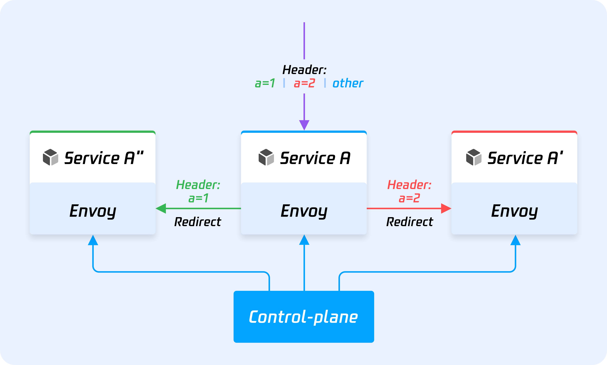
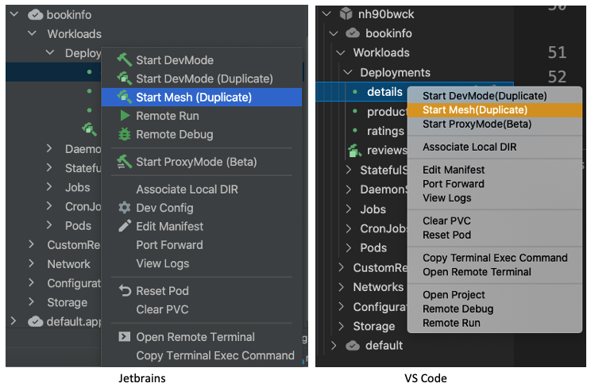
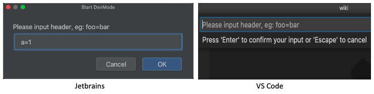
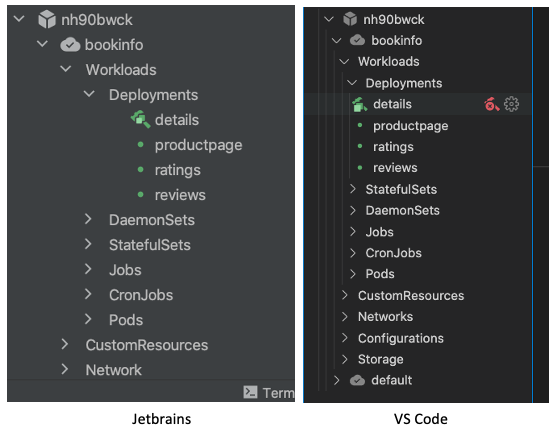

## **为什么要网格 DevMode**

考虑多个用户可能需要同时开发一项服务，但是如果使用 DevMode 重复，它将不会接收流量，如果使用 DevMode 替换，它只能由一个用户 Dev，因此我们创建另一个称为 MESH DEVMODE 的 DevMode，请使用特殊的标题将路由到您的 Devmode Pod，其他流量将路由到原始 POD。

## 怎么运行的

使用特使将流量与标头路由，我们制作一个控制平面以分发路线规则。

Like the picture below:

Service A is original, receive inbound traffic

Service A' is created by one user enter mesh devMode with special header `Header: a=1`

Service A'' is created by another user enter mesh devMode with special header `Header: a=2`

Traffic with header `Header: a=1` will route to Service A'

Traffic with header `Header: a=2` will route to Service A''

Otherwise, traffic will other header, like `Header: b=1` or `Header: c=2` or without header, will handle by Service A

## 如何使用

Right-click `Start Mesh(Duplicate)` on the Jetbrains and VS Code extension to enter `Mesh DevMode`:

Then, you need to set a header to indicate traffic with this header will route to this pod.

Enter `Mesh DevMode` and you will see the corresponding icon of the workload, indicating that the workload is
in `Mesh DevMode`.

## 常问问题

??? question "我们是否需要安装 ISTIO 来使用网格 Devmode？"

    No, Mesh DevMode use envoy as data-plane, not depends on istio.

??? question "`Duplicate DevMode` `Replace DevMode` 和 `Mesh DevMode`有什么区别?"

??? question "`Mesh DevMode` 是否支持所有协议?"

    No, it just supports HTTP/GRPC.

??? question "重复数量是否有限制？"

    There is no limitation on the number of duplicates in Nocalhost. Theoretically, `Mesh DevMode` can be run on any number
    of devices to create their own duplicates for development. However, it may be limited by cluster resources in real
    scenarios.

??? question "如何验证网格 devmode 正常工作？"

    You can not use port-forward to verify Mesh devMode, because of localhost traffic will route to local, you can use two
    ways to verify it:

    - enter another pod terminal, use command line `curl` to send request to origin pod with special header to verify Mesh
      DevMode.
    - port-forward service to local, access this service with special header to verify Mesh DevMode.
