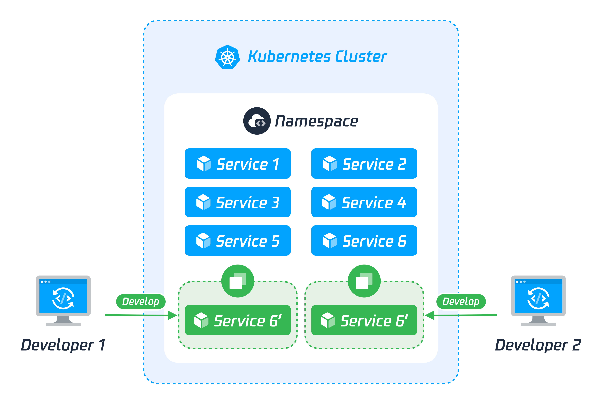
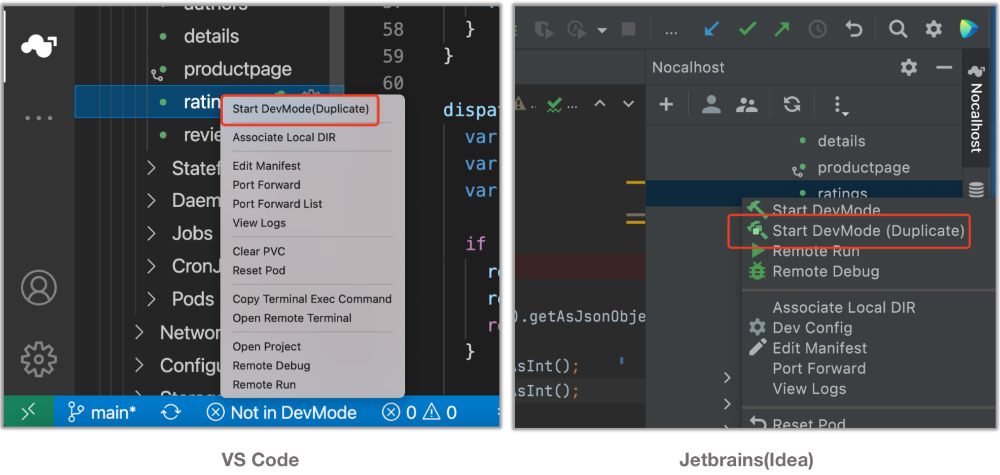
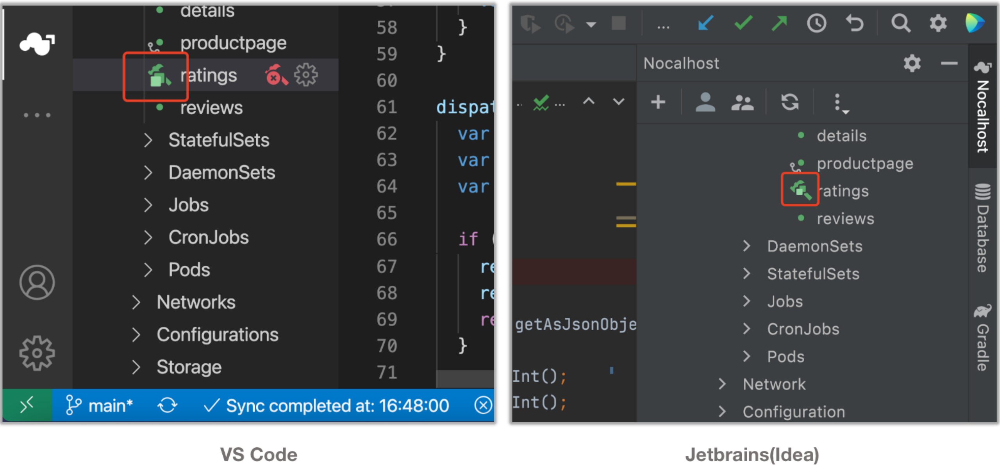

## 为什么要重复 DevMode

Nocalhost 默认的开发模式是替换镜像(`Replace DevMode`)的方式，当对某个工作负载进行开发的时候，会把原有的工作负载的容器镜像替换成开发镜像，如下图所示：

使用直接替换镜像的方式可以很好地保持原有的服务间调用关系，让集群中其它服务的流量打到正在开发的服务上，但是也存在以下不足:   

1. 容易破坏原有的环境，可能会因为开发中的服务出现问题而导致整个环境出问题   
2. 容易影响其它团队成员对环境的正常使用，其它团队成员可能只想访问正常的的环境，而不是处于开发中的环境   
3. 多个团队成员无法对同一套环境的同一个服务进行开发   

为了解决以上问题，我们可以使用`Duplicate DevMode`进行开发。

## 怎么运行的

在 `Duplicate DevMode` 中，Nocalhost 不会对原有原有工作负载进行任何修改，而是创建一个原有工作负载的副本，在该副本上进行开发。在不同设备上可以同时使用 `Duplicate DevMode` 创建工作负载的副本进行开发，副本上会被 Nocalhost 打上设备的 ID (设备 ID 由 Nocalhost 自动生成，对用户透明，并保证不同设备上的设备 ID 不会重复)以标识该副本是哪个设备在进行开发，各个副本之间互不影响，如下图所示：

副本及其管理的 Pod 会使用和原有工作负载不一样的 labels，所以它不会接收任何访问原有工作负载的流量。这么做的原因是，和 `Replace DevMode` 不同，`Duplicate DevMode` 是允许在多台设备上同时进入开发模式的，如果副本和原有工作负载一样都接收来自线上流量的话，我们无法知道当前访问的环境使用的哪个设备上正在开发的服务，从而会导致访问环境的结果变得不可预期。

!!! caution

    如果微服务应用使用了第三方的服务发现组件(如 NACOS)，而不是使用 K8s 的 Service 来进行服务发现，那么仍然可能出现集群中其它服务访问到 `Duplicate Mode` 创建的副本，从而导致访问环境的结果变得不可预期。这种场景需要自行控制启动的服务是否需要注册到服务注册中心

`Duplicate Mode` 和 `Replace Mode` 可以在不同设备上同时使用，但同一设备上，仅能选择其中一种进入开发。

当我们需要访问副本中正在开发的服务时，可以通过 Nocalhost 的端口转发功能将本地端口转发到远端服务的目标端口，在本地通过 `lcoalhost:[本地端口]` 的方式来访问服务

!!! tip

    创建出来的副本对用户透明，不会显示在 VS Code 和 Jetbrains 的工作负载列表中

## 如何使用

在 Jetbrains 和 VS Code 插件上，右键点击 `Start DevMode(duplicate)` 即可进入 `Duplicate DevMode`:

进入 `Duplicate DevMode` 之后相应的工作负载会显示相应图标表明该工作负载处于 `Duplicate DevMode`：

进入 `Duplicate DevMode` 后的其它操作和默认的开发模式一样。

!!! tip

    和默认的开发方式一样，如果需要通过本地端口访问开发中的服务，右键点击 `Port Forward` 使用 Nocalhost 的端口转发功能即可

## 常问问题

### 既然不能接收其他服务的流量，那和在本地直接把程序跑起来开发有什么区别?

在本地直接运行程序可能需要导入很多环境变量，如果工作负载依赖集群中的其他 k8s 资源，如(configmap/secrets)，处理起来就会更麻烦。
本地程序因为和集群处于不同的网络之下，访问集群中的其它服务(如 mysql, redis 等)，也需要特殊的配置，而 `Duplicate Mode` 创建出来的副本虽然不能被其它服务访问，但是是可以直接访问集群中的其它服务的。
另外，在容器中开发可以更好地与生产环境保持一致性。

### 副本数量有限制吗?

Nocalhost 没有对副本数量进行限制，理论上任意数量的设备都可以使用 `Duplicate Mode` 创建属于自己的副本进行开发，实际场景可能受限于集群资源等。
