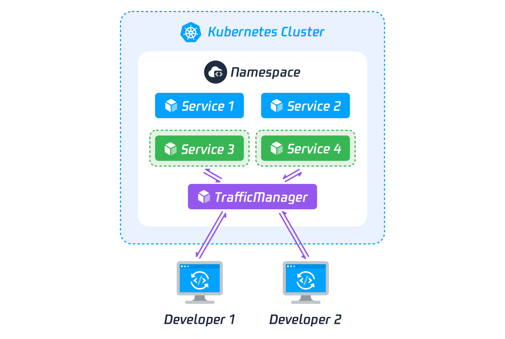
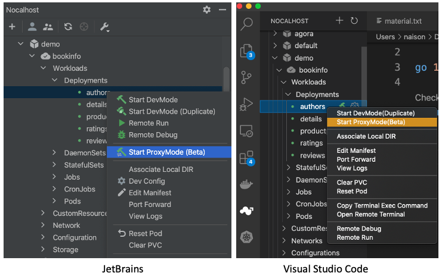
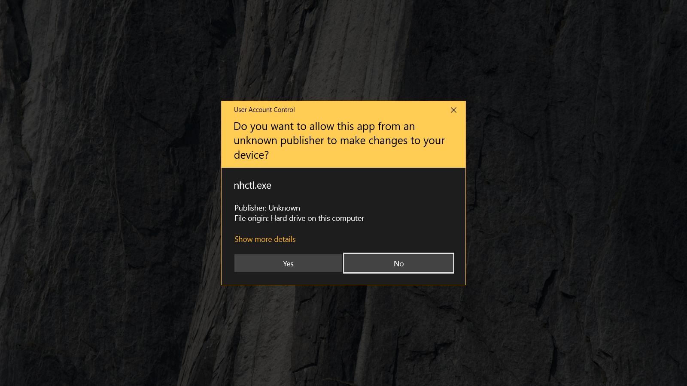
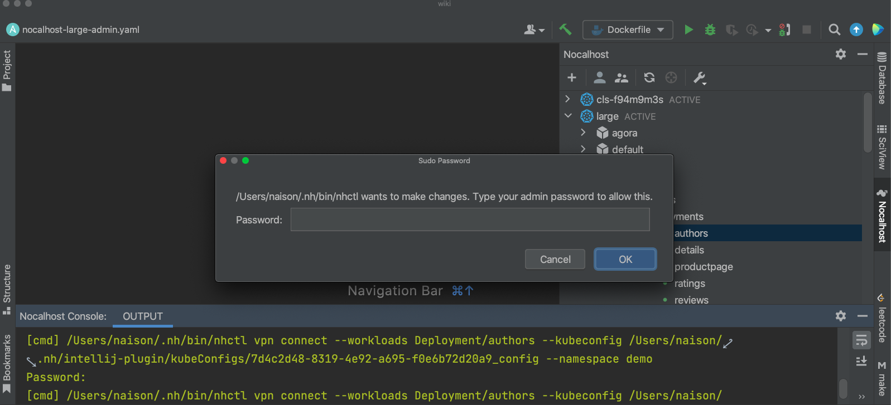
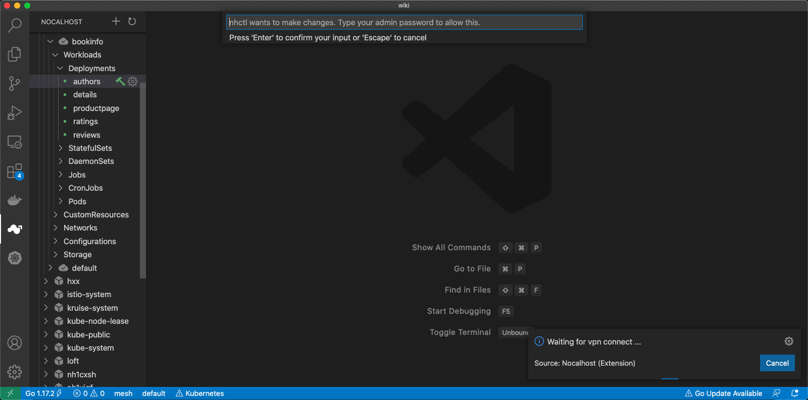

## VPN 代理模式

Nocalhost 已经支持 VPN 功能，如果您的应用程序可以以简单的方式启动并且对 K8S 资源（例如 PVC，Secret，CM 等）的依赖程度较小。那么，使用流量代理模式进入开发模式非常适合。

在这种模式下，Nocalhost 将为您提供本地 K8S 网络环境，您可以直接使用 K8S DNS 访问 K8S 服务（例如直接通过 SVC 名称直接访问 K8S 服务），POD IP，SVC IP 等。

同时，Nocalhost 将拦截指定服务的所有入站流量，并将其转发到本地，您可以直接在本地启动业务代码进行开发和调试。

## 特征

- 使用 K8S DNS 访问本地计算机上的远程服务。
- 拦截特殊服务的所有入口流量，然后将其转发到本地服务。
- 支持多个协议，例如 TCP，UDP，ICMP 等。
- 支持多个平台，例如 Windows，MacOS，Linux 等。

## 建筑学

像下面的图片一样，在同一集群和名称空间

- 开发人员 1 拦截服务 3。
- 开发人员 2 拦截服务 4。
- 服务 3 所有入站流量将转发给开发人员 1 Thought Pod Acrivermanager。
- 服务 4 所有入站流量将转发给开发人员 2 Thought Pod Acrivermanager。
- 开发人员 1 可以访问群集另一个服务思想 pod 流动管理器。
- 开发人员 2 可以访问群集另一个服务思想 pod 流动管理器。
- 开发人员 1 和开发人员 2 可以通过内部 IP（**Magic**）相互访问。

## 如何使用它

### 输入 VPN 代理模式

- 在窗户上，您将看到一个带有全屏的提示，请记住选择是

- 在 Linux/MacOS 上，您需要输入 sudo 密码以允许 NHCTL 创建虚拟网络设备

### 演示

