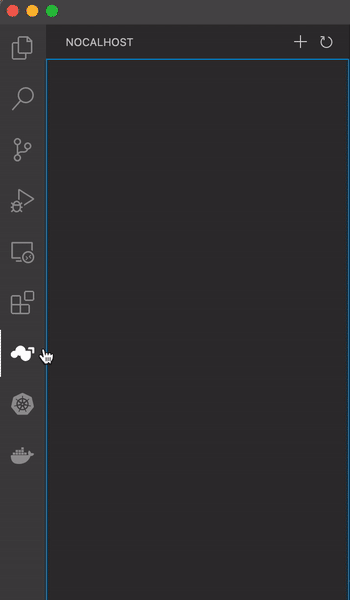
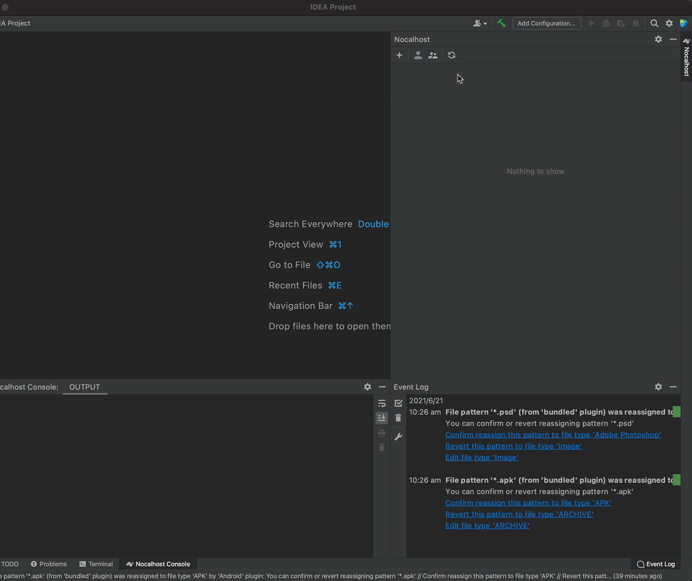
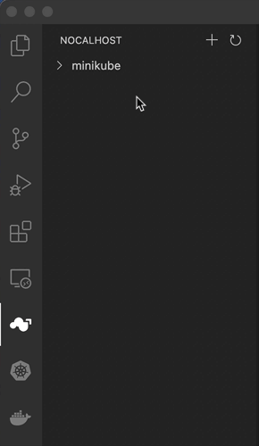
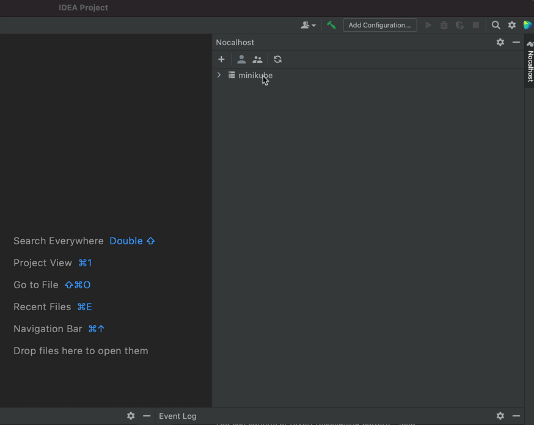
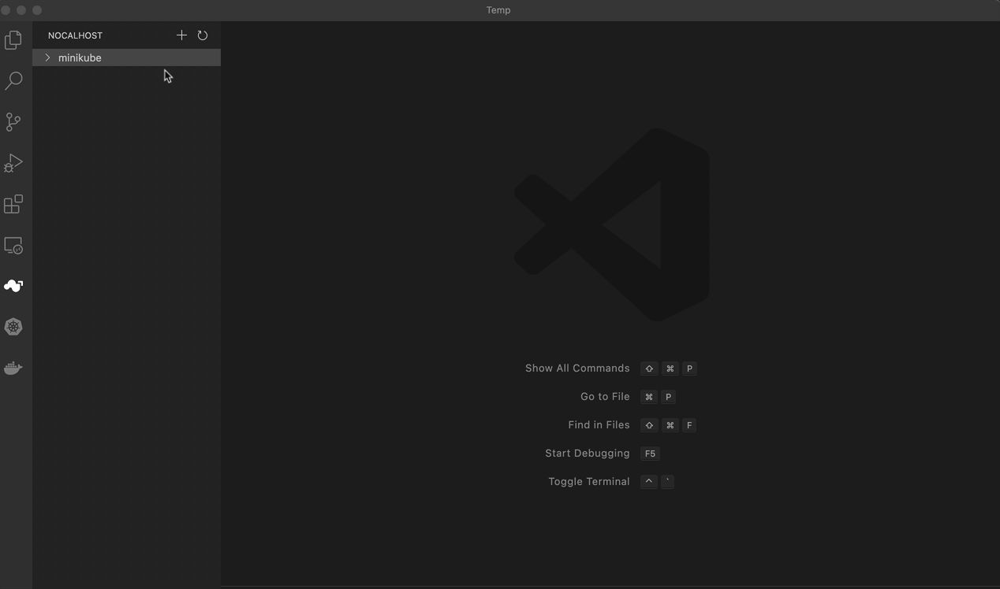
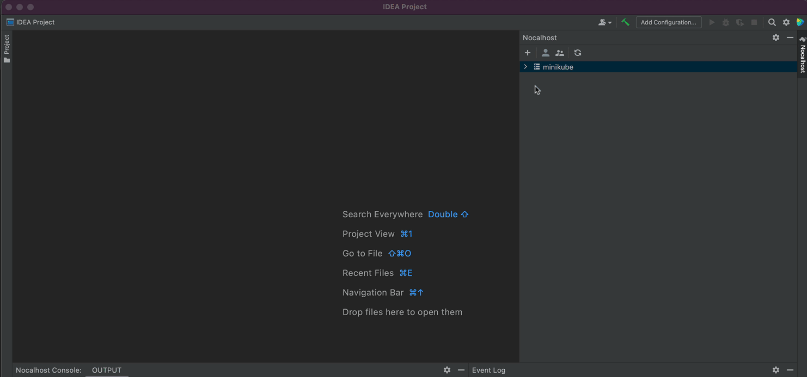

## 连接到 K8S 群集

Nocalhost 支持多集群管理，您可以使用两种方法连接到 Kubernetes 群集：

**由 kubeconfig 连接**

从任何本地目录中选择`KubeConfig`文件。

!!! tip "默认 KubeConfig"

    默认情况下，Nocalhost将尝试从本地的`~/.kube/config`加载`kubecconfig`。

**将 kubeconfig 粘贴为文本**

将`KubeConfig`作为文本粘贴。

!!! tip "获取 Kubeconfig"

    您可以使用以下命令查看您的`KubeConfig`，复制并粘贴到Nocalhost插件。

    ```bash
    kubectl config view --minify --raw --flatten
    ```

=== "vscode"

    

=== "jet"

    

## 删除群集

!!! note "KubeConfig Unchanged"

    Nocalhost只会从检查器中移除集群，它不会修改你的`kubecconfig`。

=== "vscode"

    

=== "jet"

    

## 查看 KubeConfig

右键单击指定的集群并选择`View KubeConfig`，Nocalhost 插件将打开集群的`kubecconfig`。

=== "vscode"

    

=== "jet"

    
