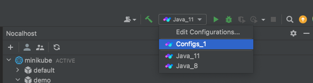

# 远程运行

当您在 Kubernetes 群集中启动新容器时，Kubernetes 将不会在此容器中启动任何进程。Nocalhost 可以使用运行配置在 Kubernetes 群集中运行代码，喜欢在 IDE 内使用运行功能。

## 支持的 IDE

<table>
  <tbody>
    <tr>
      <th>Language</th>
      <th>IDE</th>
      <th>Edition</th>
      <th>Required Plugin</th>
    </tr>
    <tr>
      <td>Java</td>
      <td>IntelliJ IDEA</td>
      <td>Ultimate</td>
      <td>N/A</td>
    </tr>
    <tr>
      <td rowSpan="2">Go</td>
      <td>IntelliJ IDEA</td>
      <td>Ultimate</td>
      <td>Go plugin</td>
    </tr>
    <tr>
      <td>GoLand</td>
      <td>Professional</td>
      <td>N/A</td>
    </tr>
    <tr>
      <td rowSpan="2">Python</td>
      <td>IntelliJ IDEA</td>
      <td>Ultimate</td>
      <td>Python plugin</td>
    </tr>
    <tr>
      <td>PyCharm</td>
      <td>Professional</td>
      <td>N/A</td>
    </tr>
    <tr>
      <td rowSpan="2">PHP</td>
      <td>IntelliJ IDEA</td>
      <td>Ultimate</td>
      <td>PHP plugin</td>
    </tr>
    <tr>
      <td>PHPStorm</td>
      <td>Professional</td>
      <td>N/A</td>
    </tr>
    <tr>
      <td rowSpan="2">Node.js</td>
      <td>IntelliJ IDEA</td>
      <td>Ultimate</td>
      <td>Node.js plugin</td>
    </tr>
    <tr>
      <td>WebStrom</td>
      <td>Professional</td>
      <td>N/A</td>
    </tr>
  </tbody>
</table>

## 远程运行过程

1. 选择要运行的工作负载
2. Right-click the workload and select **`Dev Config`**, [configure your run configuration](#configuration)
3. Then right-click this workload again and select **Remote Run**
4. Nocalhost will automatically enter the `DevMode` and start remote run

### IDE 中的远程运行配置

Before starting remote run, if you do not have a Nocalhost IDE run configuration under an existing workload, Nocalhost will create a new IDE run configuration according to your [Nocalhost configuration](#configuration). Different IDE has different configuration names and templates.

!!! tip "Multi Configs"

    If you already have a Nocalhost IDE run configuration under the existing workload, Nocalhost will use the first one to start running. You can change the order in the `Run/Debug Configurations` window within IDE.

    

## 配置

开发环境之间的开发环境不同。您应该根据实际情况配置远程运行配置。

### 示例配置

=== "java"

    ```yaml title="Nocalhost Configs"
    name: java-remote-run
    serviceType: deployment
    containers:
      - name: ""
        dev:
            ...
            command:
              run:
                - /home/nocalhost-dev/gradlew
                - bootRun
            ...
    ```

=== "python"

    ```yaml title="Nocalhost Configs"
    name: python-remote-run
    serviceType: deployment
    containers:
      - name: ""
        dev:
          ...
            command:
              run:
                - ./run.sh
            ...

    ```

    ```yaml title="run.sh"
    #! /bin/sh

    pip3 install --no-cache-dir -r ./requirements.txt

    export DEBUG_DEV=0
    export FLASK_DEBUG=0
    export FLASK_ENV=development

    flask run --host=0.0.0.0 --port=9999
    ```

=== "go"

    ```yaml title="Nocalhost Configs"
    name: go-remote-run
    serviceType: deployment
    containers:
      - name: ""
        dev:
            ...
            command:
              run:
                - ./run.sh
            ...

    ```

    ```yaml title="run.sh"
    #! /bin/sh

    export GOPROXY=https://goproxy.cn
    go run app.go
    ```

=== "php"

    ```yaml title="Nocalhost Configs"
    name: php-remote-run
    serviceType: deployment
    containers:
      - name: ""
        dev:
            ...
            command:
              run:
                - ./run.sh
            ...

    ```

    ```yaml title="run.sh"
    #！/bin/sh

    php -t ./ -S 0.0.0.0:9999;
    ```

=== "node"

    ```yaml title="Nocalhost Configs"
    name: node-remote-run
    serviceType: deployment
    containers:
      - name: ""
        dev:
            ...
            command:
              run:
                - ./run.sh
            ...

    ```

    ```yaml title="run.sh"
    #！/bin/sh

    npm install && node ratings.js 9080
    ```
