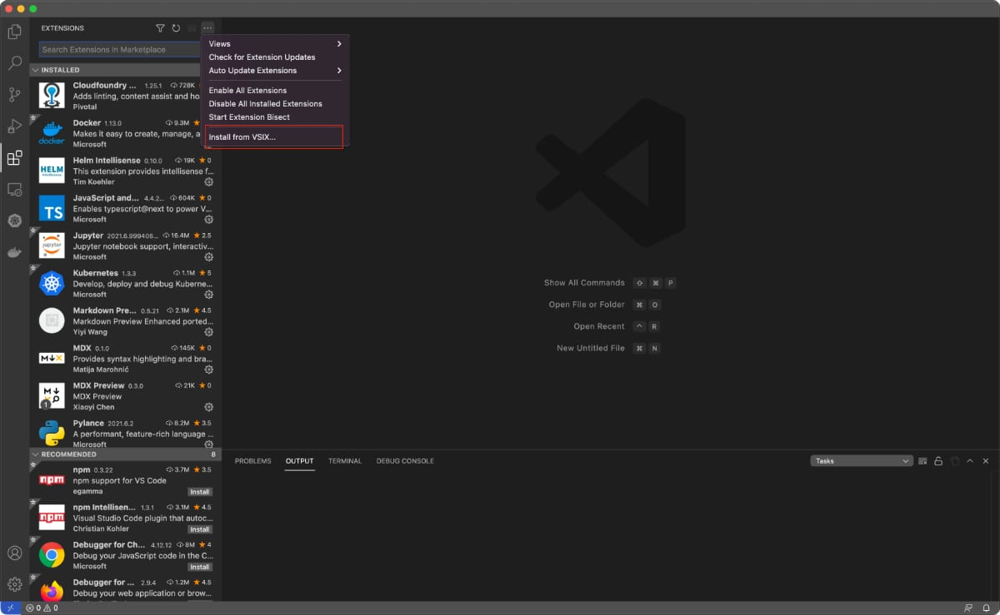
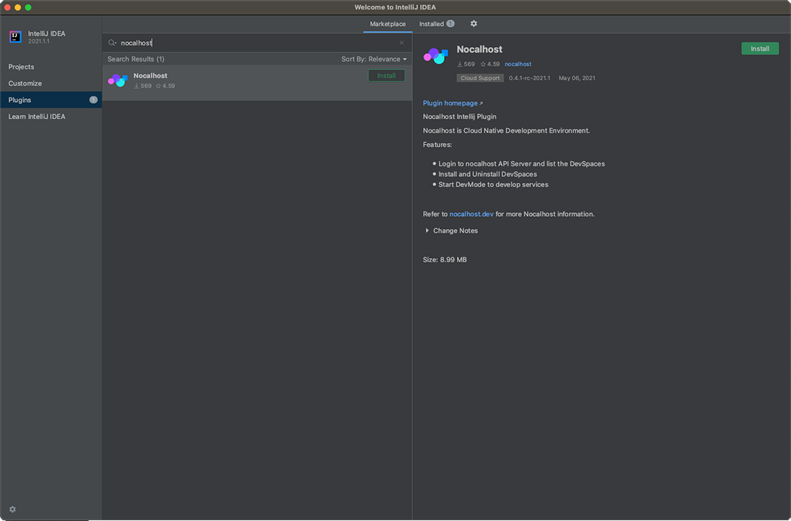
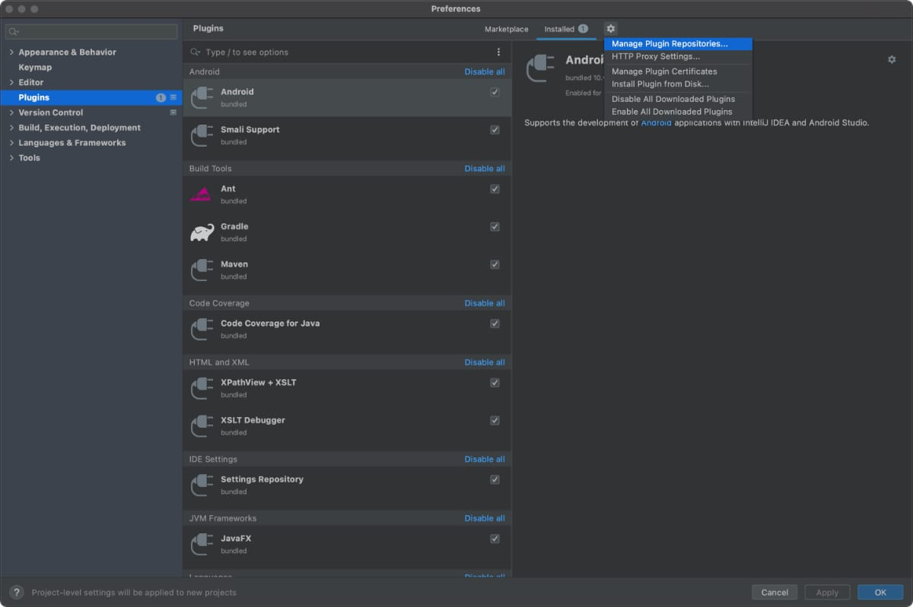

# 安装 Nocalhost

!!! tip "nhctl"

    安装Nocalhost IDE插件时，它将自动为您安装`nhctl`。

## 兼容的

<table>
    <thead>
        <tr>
            <th>IDE</th>
            <th>Version</th>
            <th>Result</th>
        </tr>
    </thead>
    <tbody>
        <tr>
            <td>VS Code </td>
            <td>1.58.2 (Universal)</td>
            <td><strong className="pass-tag"passed</strong></td>
        </tr>
        <tr>
            <td rowspan="3" >JetBrains</td>
            <td>2021.2 - Intel and Apple Silicon</td>
            <td><strong className="pass-tag"passed</strong></td>
        </tr>
        <tr>
            <td>2021.1 - Intel and Apple Silicon</td>
            <td><strong className="pass-tag"passed</strong></td>
        </tr>
        <tr>
            <td>2020.3 - Intel and Apple Silicon</td>
            <td><strong className="pass-tag"passed</strong></td>
        </tr>
    </tbody>
</table>

## 安装 VS 代码插件

=== "market"

    1. Open VS Code and go to `Extensions` by click the  icon
    2. Input `Nocalhost` in the search box
    3. Select the `Nocalhost Extension`, and click the **Install** button.

    

=== "manual"

    1. Download the latest version from our [Github Repo](https://github.com/nocalhost/nocalhost-vscode-plugin/releases/latest)
    2. Open VS Code and go to `Extensions` by click the  icon
    3. Click  on the top right of the `Extension` list, select `Install from VSIX...`, select the `VSIX` downloaded above
    4. Download the latest nhctl from out [Github Repo](https://github.com/nocalhost/nocalhost/releases), and put it under `~/.nh/bin/` then named nhctl, you need to give this binary execution permission (chmod +x ./nhctl). (the path is %homepath%/.nh/bin/ in windows, and the binary named 'nhctl.exe', no need to grant additional execution permissions under windows)

    

## 安装 Jetbrains 插件

=== "market"

    #### Windows

    `File > Settings > Plugins > Browse repositories... > Search for "Nocalhost" > Install Plugin`

    #### MacOS

    `Preferences > Settings > Plugins > Browse repositories... > Search for "Nocalhost" > Install Plugin`

    

=== "manual"

    1. Download the latest version from our [Github Repo](https://github.com/nocalhost/nocalhost-intellij-plugin/releases/latest)
    2. Install plugin: <kbd>Preferences</kbd> > <kbd>Plugins</kbd> > <kbd>Install from disk... </kbd>
    3. Download the latest nhctl from out [Github Repo](https://github.com/nocalhost/nocalhost/releases), and put it under `~/.nh/bin/` then named nhctl, you need to give this binary execution permission (chmod +x ./nhctl). (the path is %homepath%/.nh/bin/ in windows, and the binary named 'nhctl.exe', no need to grant additional execution permissions under windows)

    

## 升级插件

IDE 启动时，Nocalhost 将自动检查并安装最新的更新。

## 卸载

您可以通过以下内容完全卸载 nocalhost

### 卸载 IDE 插件

卸载 IDE 中的 Nocalhost IDE 插件

### 删除 `nhctl`

删除根目录中的`.nh`文件夹

=== "mac"

    `.nh` 文件夹在您的`~/`目录中, 您可以通过以下命令将其删除

    ```bash
    rm -rf .nh
    ```

=== "windows"

    `.nh` 文件夹在您的`<ROOT PATH>/User/username/`目录中, 您可以删除它.
