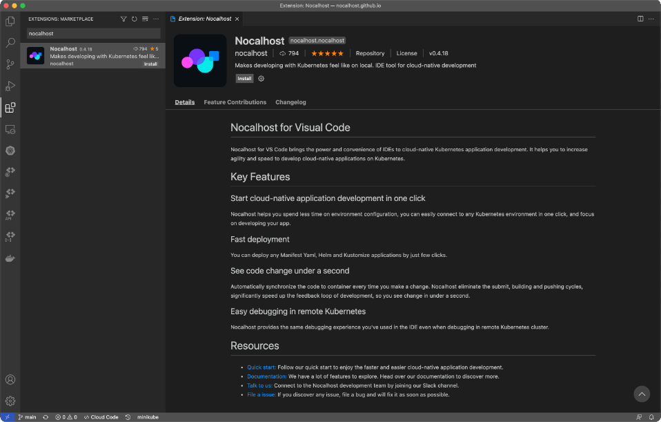
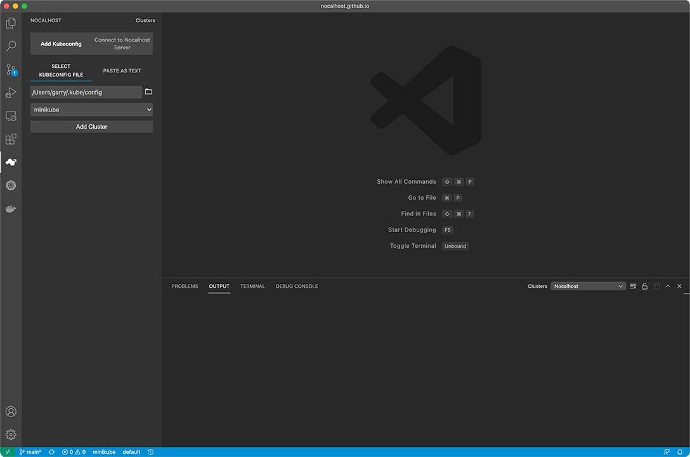
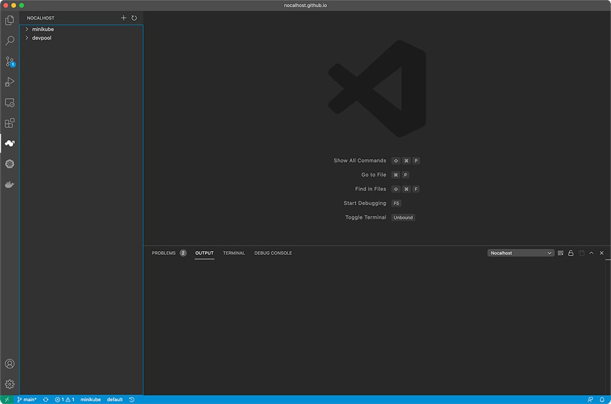
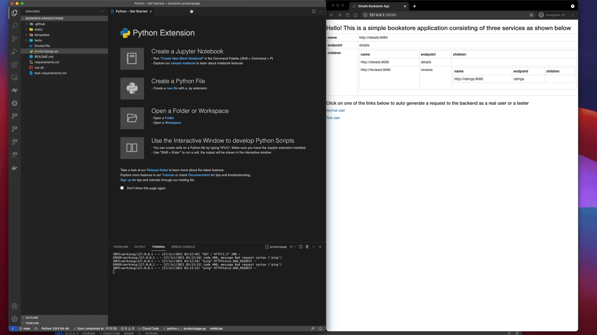

# 快速开始

!!! note "关于本指南"

    - **目标:** 安装Nocalhost，评估核心功能并体验有效的云本地应用程序开发。
    - **估计时间:** 5分钟
    - **要求:**

        - 任何本地或远程Kubernetes集群(minikube, Docker Desktop, TKE, GKE, EKS, AKS, Rancher…).
          为[Docker Desktop]和[minikube]等单节点集群分配至少4gb内存。
        - **RBAC** 必须在上述集群中启用
        - **Socat** 需要安装在集群的节点上(Nocalhost文件同步依赖于端口转发)
        - **配置的kubecconfig文件** 具有名称空间管理权限
        - Kubernetes api-server支持内部和外部访问
        - Visual Studio Code (1.52+)

[docker desktop]: (https://docs.docker.com/docker-for-mac/kubernetes/)
[minikube]: (https://minikube.sigs.k8s.io/docs/start/)

## 1. 安装 Nocalhost VS Code 扩展

1.  打开 VS 代码，然后单击图标进入扩展
2.  在搜索框中输入`nocalhost`
3.  选择`Nocalhost Extension`，然后单击 **安装** 按钮。

    

    !!! tip "JetBrains Plugin"

        Nocalhost确实完全支持Jetbrains，请参阅[安装Jetbrains插件](./installation##install-jetbrains-plugin).

## 2. 连接到 Kubernetes 群集

单击侧面面板上的 Nocalhost 图标，打开 Nocalhost 插件。



您可以使用两种方法连接到 Kubernetes 群集：

=== "通过 KubeConfig"

    从本地目录中选择 `KubeConfig` 文件。

    !!! info "默认 KubeConfig"

          Nocalhost将尝试从您的本地`〜/.kube/config`加载`kubeconfig`默认情况下。

=== "粘贴作为文本"

    将 `KubeConfig` 粘贴为文本

    !!! tip "获取 KubeConfig"

        您可以使用以下命令查看您的 `KubeConfig` 并复制它。

        ```bash
        kubectl config view --raw --flatten
        ```

成功加载`KubeConfig`后，选择要访问的上下文，然后连接到集群。

**Nocalhost** 将自动显示集群列表。



## 3. 输入开发模式

!!! tip "Application"

    我们在此处以BookInfo应用程序为例。
    您可以使用已经部署在Kubernetes群集中的应用程序，也可以关注 **[部署演示应用程序](./guides/deploy/deploy-demo.md)** 在Kubernetes群集中部署演示应用程序。

确保您在 Kubernetes 群集中成功部署了工作负载，然后：

1. 扩展工作负载树，找到要开发的工作负载
2. 单击开始 `Development Mode (DevMode)`
3. 指定源代码本地目录，也可以从现有的 GIT 存储库中克隆。
4. Nocalhost 将打开一个新的 VS 代码窗口，并自动启动`devmode`。


!!! warning "关于前提"

    如果您正在遇到DevMode在“前提K8S群集”中，则需要[配置SideCar映像地址](./config/config-dev-container#sidecar-image-customization)并将镜像推到您自己的存储库中。

## 4. 更改代码并查看结果

### 在远程容器中执行主进程

1.  在远程终端中运行以下命令以启动主进程

    ```bash
    sh run.sh
    ```

    !!! tip "主要过程"

        输入DevMode时，应用程序主进程默认情况下不会自动启动，因此该应用程序不会响应任何请求。您需要手动启动主过程，然后才能访问它。

2.  在您的 Web 浏览器中查看[http://127.0.1:39080](http://127.0.0.1:39080)上的运行结果

    

    !!! note "Port-Forwarding"

        在我们的“Bookinfo”演示中demo, 我们已经将Port-Forward设置为39080:9080, 这意味着Nocalhost将自动将数据从本地端口 **39080** 转发到端口 **9080**.

### 更改代码

1.  修改`productPage.py`中的代码，并查看 Web 浏览器中的更改。 **不要** 忘记保存更改。
2.  刷新网络浏览器并查看代码更改

    

👍 **恭喜!** 你们都准备去

## 下一步是什么？

- 请参阅 Nocalhost 的[简介](./introduction)
- 访问我们的[github repo](https://github.com/nocalhost/nocalhost)
- 加入我们的[Slack](https://nocalhost.slack.com/)或扫描代码以加入我们的微信组


