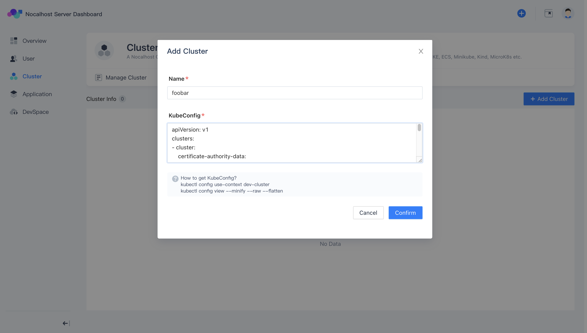
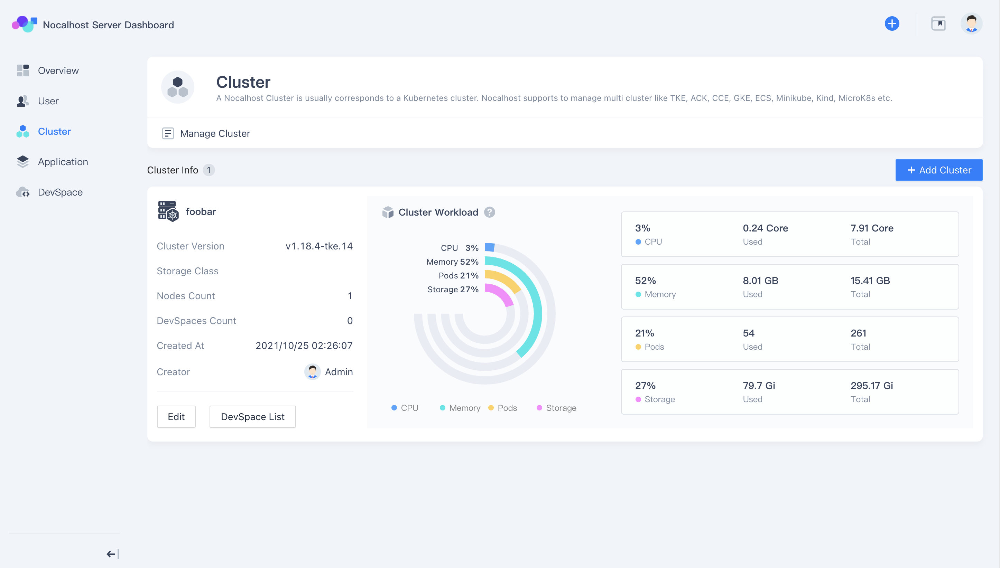

# 快速开始

!!! note "关于本指南"

    - **Goal :** 将Nocalhost Sever部署到Kubernetes群集。
    - **Estimate time :** 5 minutes
    - **Requirements :**

        - Any local or remote Kubernetes cluster (minikube, Docker Desktop, TKE, GKE, EKS, AKS, Rancher, ...). Allocate at least 4 GB of memory for single node clusters like [Docker Desktop](https://docs.docker.com/docker-for-mac/kubernetes/) and [minikube](https://minikube.sigs.k8s.io/docs/start/).
        - **RBAC** must be enabled in above cluster
        - **Configured kubeconfig file** that has namespace admin privilege
        - **Nocalhost IDE Plugin** installed
        - Kubernetes api-server can be accessed internal and external
        - **[Helm](https://helm.sh/docs/intro/install/)** 3+

## 1. Add Helm Chart Repository

```console
helm repo add nocalhost "https://nocalhost-helm.pkg.coding.net/nocalhost/nocalhost"
helm repo update
```

## 2. Install the Nocalhost Server

```console
helm install nocalhost nocalhost/nocalhost -n nocalhost --create-namespace
```

!!! caution "No PVC"

    The above deployment will create a pvc for `mariadb`. If you do not have pvc or without permission to create, you can use the `--set mariadb.primary.persistence.enabled=false` to deploy Nocalhost Server without creating pvc.

## 3. Waiting for Pods to be Ready

You can check the pods status by `kubectl` or other Kubernetes tools.

```console
❯ kubectl -n nocalhost get pods
NAME                            READY   STATUS    RESTARTS   AGE
nocalhost-api-b48f7799d-wr4ps   1/1     Running   3          2m7s
nocalhost-mariadb-0             1/1     Running   0          2m2s
nocalhost-web-9dd659b8-s89f4    1/1     Running   0          2m7s
```

## 4. Port-Forwarding to Access Web Service

Once the deployment completed, you need to manually port-forward the Nocalhost Web Service to local by using the following command.

```console
❯ kubectl -n nocalhost port-forward service/nocalhost-web 8080:80
```

You can now access the nocalhost dashboard with [http://127.0.0.1:8080](http://127.0.0.1:8080)

```yaml title="Default username and password to access web service"
Email: admin@admin.com
Password: 123456
```

## 5. Add Dev Cluster

Access the nocalhost dashboard, `Cluster`-->`Add Cluster`. Copy the contents of the **Admin** kubeconfig and paste it into the input box.




