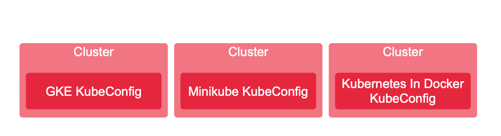
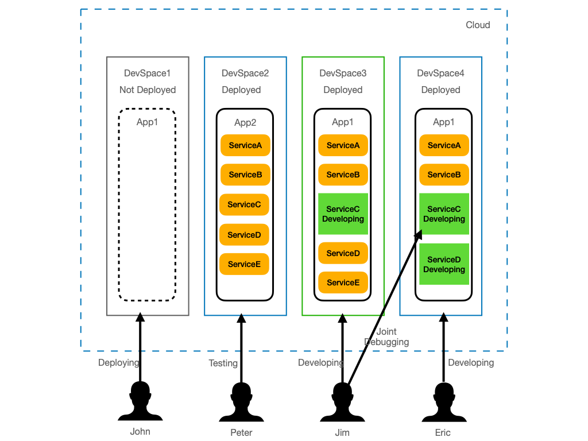
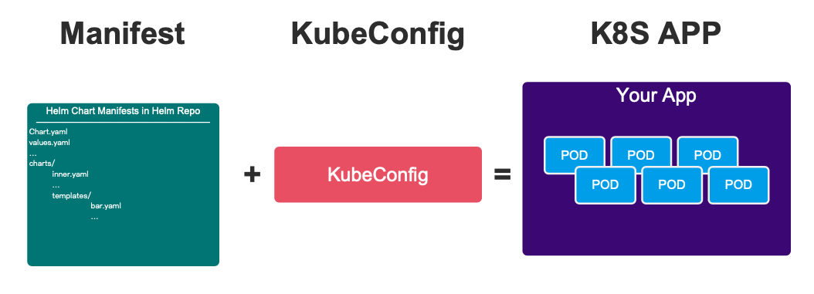
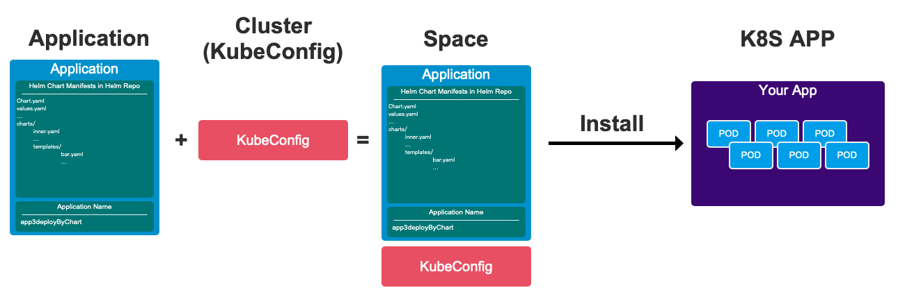
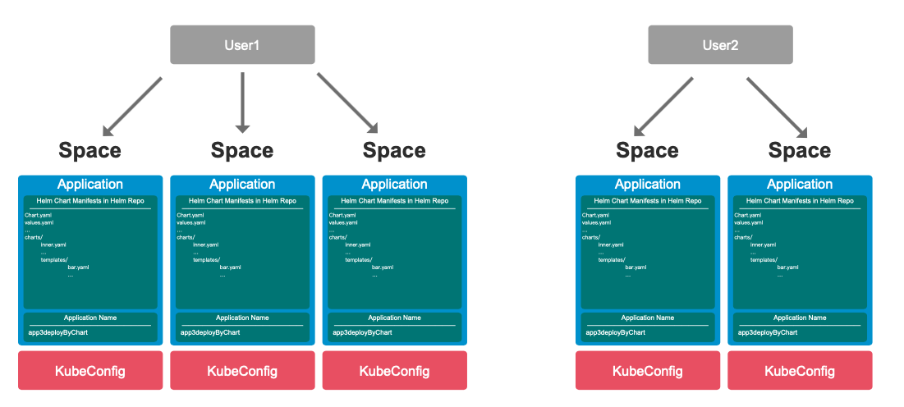
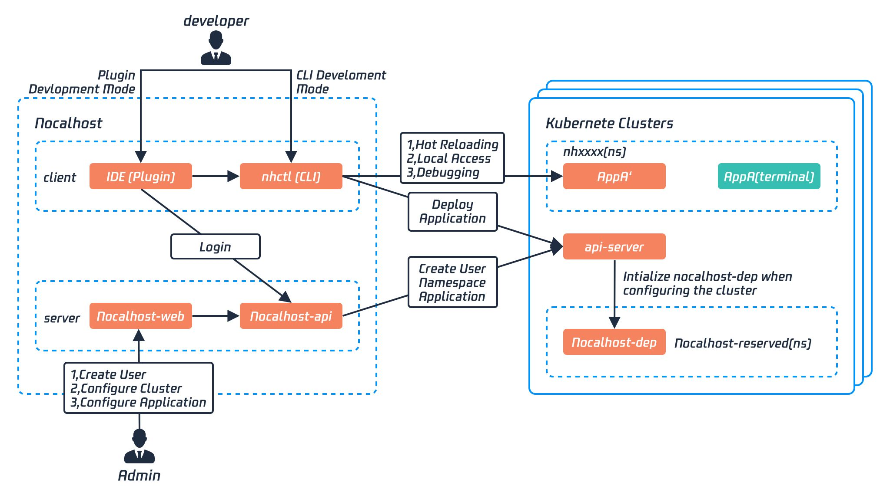

# 概述

在本文档中，我们将解释 Nocalhost 服务器的核心思想，并阐明项目中广泛使用的一些技术术语。

## 概念

### 集群

Nocalhost **集群** 通常对应于 Kubernetes 群集。Nocalhost 支持管理 TKE，GKE，Minikube 等多群集。

在实际开发过程中，用户不需要知道群集的概念，而[DevSpace](#devspace)下的用户操作实际上依赖于群集的功能。

#### 集群管理

!!! tip "KubeConfig"

    If you want to manage a Cluster，then need to maintain a `KubeConfig` with the cluster's Cluster-Admin role.

Cluster is generally used with DevSpace, if you need to manage Cluster, you refer to [Manage Cluster](./manage-devspace-iso)

### DevSpace

**DevSpace** 是 Nocalhost 的概念，它代表了由 Nocalhost 管理的预先分配的开发空间。
开发人员可以在 DevSpace 内部部署，卸载，开发和调试应用程序。
开发空间彼此隔离。

Nocalhost also allow developers to share their DevSpaces with other developers for collaborative development.

#### DevSpace 管理

If you need to manage **DevSpace**, you can refer to [Manage DevSpace](./manage-devspace-iso)

### 应用

**Application** is a concept of Nocalhost, it is mainly used to manage a set of manifest files you want to apply for local development, it supports both Kubernetes manifest and helm chart. In other words, these manifests usually contain all the k8s resources that your own application depends on. If possible, we should try to keep it to a minimum.

Nocalhost supports three types of applications:

- Manifest
- Helm
- Kustomize

**Application** can be used to create a [DevSpace](#devspace), we recommend using IDE plug-in directly to deploy your application, IDE plugin is worked on the DevSpace created by Application. In other words, after being assigned a DevSpace, the developer can easily develop on the IDE.

After being assigned a DevSpace, you will get a `KubeConfig` to access this DevSpace, `nhctl` or plug-in can deploy the application based on the application's manifest file and `KubeConfig`.

So **DevSpace** can actually be approximated as **Application** + **Kubeconfig**:

#### 应用程序管理

If you need to manage **Applications**, you can refer to [Manage Application](./manage-app)

### 服务

**Service** is completely different from svc of Kubernetes. Service can be considered as an enhancement of application deployment and development.

- [阅读更多信息以了解如何配置应用程序开发](../config/config-spec.md)
- [阅读更多信息以了解如何配置应用程序部署](../config/deployment/quickstart.md)

!!! caution "Service Configs"

    Service configurations are not necessary, only needs when essential.

### 用户

**User** belongs to the independent concept of Nocalhost, it's **different** with user in Kubernetes. When you use `Nocalhost Server` and Nocalhost Plugins, User is used to identify your identity and access control to resources.

There are two types of **User** in Nocalhost: **Standard User** and **System Admin**

#### 标准用户

- Can only log in IDE Plugin, users can develop under their own DevSpace. these DevSpace are all created by Administrator.
- User can only see their own DevSpace, and have all the permissions under these DevSpace, such as install, uninstall (deploy and destroy), enter DevMode and port-forwarding.
- Cannot log in to Nocalhost-Web, nor can they delete the DevSpace, or disassociate it from the DevSpace, which is very similar to the admin permission under a certain namespace of Kubernetes.

#### 系统管理员

- Has the permission to access `Nocalhost Server`, and with all the permissions in Nocalhost Web, such as create and manage Application, Cluster, User, DevSpace, etc

- Have all the permissions of **User**, such as logging in at IDE plugins, develop in their own DevSpace list

#### 用户管理

If you need to manage **User**, you can refer to [Manage User](./manage-user)

## 怎么运行的

### IDE 插件

### `nhctl`

### Nocalhost-Web

### Nocalhost-API

### Nocalhost-Dep
